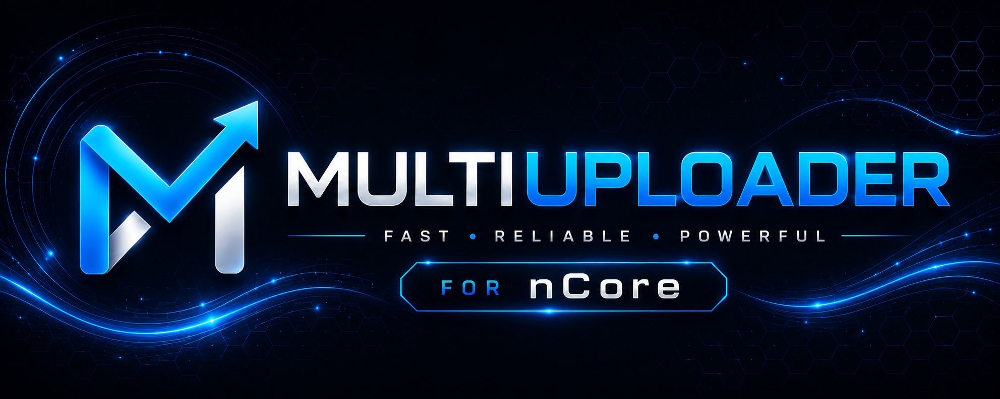
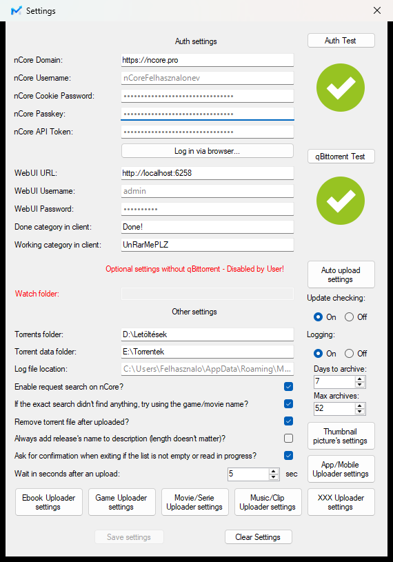
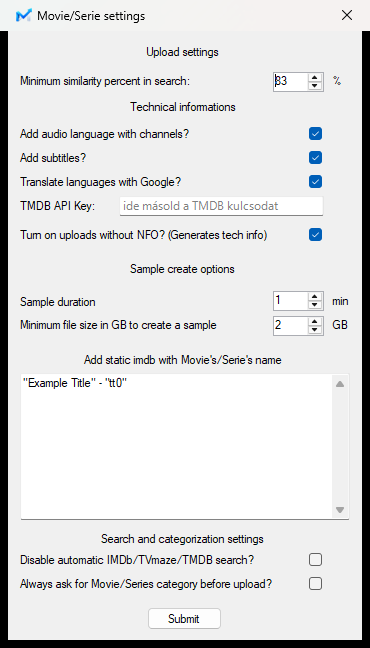
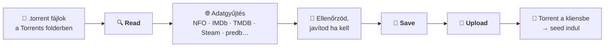
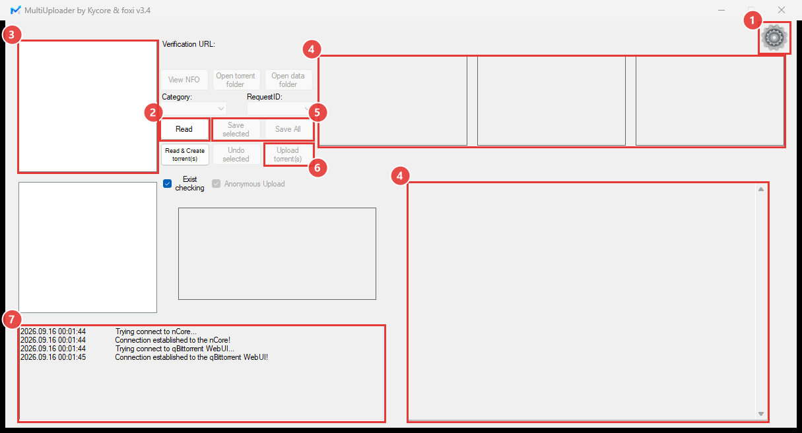
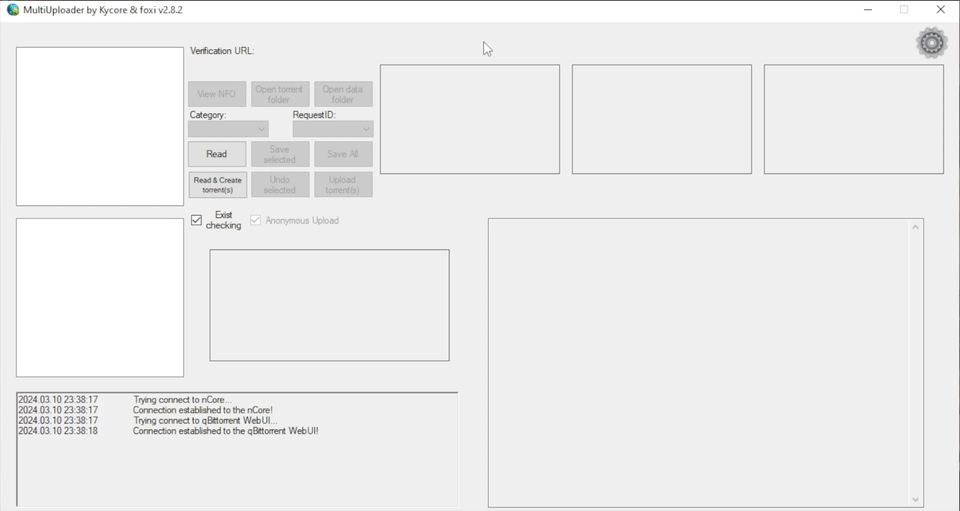

# MultiUploader for nCore

**Beolvassa a .torrent fájlt, összegyűjti hozzá a netről a leírást, képeket és adatokat, kitölti az nCore feltöltő űrlapját – te csak ellenőrzöl és rányomsz az Upload gombra.**

 

 

🎬 Film &nbsp;•&nbsp; 📺 Sorozat &nbsp;•&nbsp; 🎮 Játék &nbsp;•&nbsp; 🕹️ Konzol &nbsp;•&nbsp; 💿 Program &nbsp;•&nbsp; 📱 Mobil &nbsp;•&nbsp; 🎵 Zene &nbsp;•&nbsp; 🎤 Klip &nbsp;•&nbsp; 📖 Könyv &nbsp;•&nbsp; 🔞 XXX

 

<a href="#-mi-ez">Mi ez?</a> &nbsp;•&nbsp;
<a href="#-mire-van-szükséged">Mire van szükséged?</a> &nbsp;•&nbsp;
<a href="#-beállítás-6-lépésben">Beállítás</a> &nbsp;•&nbsp;
<a href="#-az-első-feltöltés">Első feltöltés</a> &nbsp;•&nbsp;
<a href="#-kategóriák">Kategóriák</a> &nbsp;•&nbsp;
<a href="#-haladó-beállítások">Haladó</a> &nbsp;•&nbsp;
<a href="#-hibaelhárítás">Hibaelhárítás</a> &nbsp;•&nbsp;
<a href="#-változásnapló">Változásnapló</a>

📷 <a href="docs/main.png">Főablak</a> &nbsp;·&nbsp; 📷 <a href="docs/settings.png">Beállítások</a> &nbsp;·&nbsp; 🎞️ <a href="docs/sample.gif">Működés közben (GIF)</a>

 

## ✨ Mi ez?

Ha feltöltesz nCore-ra, ismered a menetet: megnyitod a feltöltő oldalt, kikeresed az IMDb linket, a leírást, a borítót, mintaképeket készítesz, kitöltöd a technikai adatokat, kiválasztod a kategóriát… **minden egyes release-nél.** A MultiUploader ezt csinálja meg helyetted – odaadsz neki egy mappát a `.torrent` fájlokkal, és:

<table align="center">
  <tr>
    <td align="center" width="33%">
      <h3>🔍</h3>
      <b>Felismeri</b> 
      Film, sorozat, játék, program, zene, könyv, XXX – és a pontos nCore kategória (HD/SD, ISO/RIP, MP3/Lossless…)
    </td>
    <td align="center" width="33%">
      <h3>🌐</h3>
      <b>Összegyűjti</b> 
      Leírás, borító, IMDb · TMDB · Steam · GOG adatok, előadó és tracklista, ISBN – attól függően, mi a tartalom
    </td>
    <td align="center" width="33%">
      <h3>🖼️</h3>
      <b>Mintaképeket készít</b> 
      A videóból, a könyvből vagy a játék oldaláról, és feltölti őket képtárhelyre
    </td>
  </tr>
  <tr>
    <td align="center">
      <h3>📝</h3>
      <b>Kitölti</b> 
      Az nCore feltöltő űrlapját: cím, kategória, leírás, infobar kép, technikai infók, IMDb link
    </td>
    <td align="center">
      <h3>✅</h3>
      <b>Ellenőrzi</b> 
      Nincs-e már fent ugyanez a release, van-e rá nyitott kérés
    </td>
    <td align="center">
      <h3>🚀</h3>
      <b>Feltölti</b> 
      Egy gombnyomással, akár több tucatot egymás után – és a kész torrentet átadja a kliensednek, indul a seed
    </td>
  </tr>
</table>

<i>Minden adat a beolvasás után szerkeszthető a programban, mielőtt bármi felmenne az oldalra.</i>

| 🆕 Új vagy? | 🔧 Már használod? | 🆘 Elakadtál? |
|:---:|:---:|:---:|
| [Beállítás 6 lépésben](#-beállítás-6-lépésben) → [Első feltöltés](#-az-első-feltöltés) | [Kategóriák](#-kategóriák) · [Haladó beállítások](#-haladó-beállítások) · [Testreszabás](#-testreszabás) | [Hibaelhárítás](#-hibaelhárítás) |

 

## 🧩 Mire van szükséged?

| | Mi | Miért | Honnan |
|:---:|---|---|---|
| 🪟 | **Windows 10 vagy 11** | A program Windows-os asztali alkalmazás | – |
| 👤 | **nCore fiók** | Erre a fiókra fog feltölteni | – |
| 🎬 | **TMDB API kulcs** *(csak filmhez/sorozathoz)* | Innen jönnek a filmadatok, ingyenes, 3 perc regisztráció | [themoviedb.org](https://www.themoviedb.org/settings/api/request) – lásd a [3. lépést](#3-tmdb-kulcs--csak-filmhez-és-sorozathoz) |
| 🧲 | **qBittorrent** *(nem kötelező)* | Ha használod, a program feltöltés után automatikusan hozzáadja a torrentet és indul a seed | [qbittorrent.org](https://www.qbittorrent.org/) |

> [!NOTE]
> Minden mást a program **maga intéz**: a beépített böngészőhöz szükséges WebView2 futtatókörnyezetet és a mintaképekhez szükséges FFmpeg-et első használatkor letölti és telepíti.

 

## 🚀 Beállítás 6 lépésben

> [!TIP]
> Kb. **10 perc**, egyszer kell megcsinálni. A sorrend számít: előbb a belépés, aztán a többi.

### 1️⃣ Telepítés

1. Töltsd le a legfrissebb `MultiUploader_Setup_x.x.exe` fájlt a repó [Releases](../../releases/latest) füléről.
2. Indítsd el, Tovább → Tovább → Befejezés. A program a Start menübe kerül.
3. Indítsd el a MultiUploadert, majd kattints a jobb felső sarokban a **⚙️ fogaskerékre** – ez a Beállítások.

### 2️⃣ Bejelentkezés nCore-ra

A Beállítások ablak felső, **Auth settings** része kell most.

📷 <i>Képernyőkép: Beállítások ablak</i>

 

1. Kattints a **`Log in via browser...`** gombra.
2. Megnyílik egy ablak az nCore bejelentkező oldalával. Jelentkezz be úgy, ahogy szoktál.
3. Az ablak magától bezárul, és a program **kitölti** a *nCore Username*, *Cookie Password*, *Passkey* és *API Token* mezőket. Ezekhez nem kell hozzányúlnod.
4. Kattints az **`Auth Test`** gombra – ha **zöld pipa** jelenik meg mellette, kész.

> [!IMPORTANT]
> Belépésnél **pipáld be a „Ne léptessen ki” opciót**, különben a bejelentkezésed pár óra után lejár, és a program nem tud majd feltölteni.

🔧 <i>Kézi kitöltés, ha a böngészős belépés nem működne</i>

 

* **Cookie Password:** Chrome-ban, az nCore belépő oldalán kapcsold be a `Csökkentett biztonság` opciót, lépj be, majd F12 → [itt találod](https://i.kek.sh/BwsW6ykghEC.png).
* **API Token:** nyisd meg pl. a [Prémium](https://ncore.pro/shop) oldalt, F12 → [itt találod](https://i.kek.sh/y00g5YkHcPL.png). 60 napig érvényes.
* **Passkey:** a profilodban, a „Saját Passkey” sorban.

A mezőkbe **ne írj idézőjelet** – ha mégis, a program kitörli.

### 3️⃣ TMDB kulcs – csak filmhez és sorozathoz

1. Regisztrálj a [themoviedb.org](https://www.themoviedb.org/signup) oldalon (ingyenes).
2. Nyisd meg az [API igénylő oldalt](https://www.themoviedb.org/settings/api/request), válaszd a **Developer** típust, töltsd ki az űrlapot (személyes használatra bármit írhatsz, pl. alkalmazás neve: *MultiUploader*, URL: *none*).
3. Másold ki az **API Key** *(v3 auth)* értéket.
4. A Beállításokban nyisd meg a **`Movie/Serie Uploader settings`** gombot (alul), és illeszd be a **TMDB API Key** mezőbe, majd **`Submit`**.

📷 <i>Képernyőkép: Movie/Serie settings</i>

 

### 4️⃣ A két mappa

| Mező | Mit adj meg | Példa |
|---|---|---|
| 📁 **Torrents folder** | A mappa, ahol a feltöltendő `.torrent` fájlok vannak | `E:\Feltöltendő` |
| 📂 **Torrent data folder** | A mappa, ahol a letöltött release-ek **mappái** vannak (a program ezekben keresi az NFO-t és a videót/könyvet a mintaképekhez) | `E:\Torrentek` |

### 5️⃣ Torrent kliens – nem kötelező

**🧲 Ha qBittorrentet használsz** – `qBittorrent settings` doboz:

1. qBittorrentben kapcsold be a WebUI-t: *Eszközök → Beállítások → Webes felület*, jegyezd meg a portot, felhasználónevet, jelszót.
2. Írd be a **WebUI URL** (pl. `http://localhost:8080`), **Username** és **Password** mezőket.
3. Kattints a **`qBittorrent Test`** gombra – zöld pipa = jó.

Feltöltés után a program letölti az nCore-ról a kész torrentet, hozzáadja a klienshez, és **azonnal indul a seed**.

**📁 Ha mást használsz** (uTorrent, Deluge…) – `Optional settings without qBittorrent` doboz: add meg a kliensed **figyelt mappáját** (*Watch folder*). A program ide teszi a kész torrentet, a kliensed pedig felveszi.

**🚫 Ha egyiket sem akarod:** hagyd üresen, a program akkor is feltölt, csak a seedet kézzel kell indítanod.

### 6️⃣ Mentés

Kattints a **`Save settings`** gombra. Kész – a program használatra kész! 🎉

 

## 🎬 Az első feltöltés

A számok a főablak képén lévő jelölőkre utalnak – nyisd le:

📷 <i>Képernyőkép: főablak a lépések számaival</i>

 

1. ⚙️ **Beállítások** (fogaskerék) – ezt már megcsináltad fent.
2. 🔍 **`Read`** – a program beolvassa a *Torrents folder* összes `.torrent` fájlját, kikeresi hozzájuk az adatokat a netről, és megnézi, nincs-e már fent az oldalon. Ha egy release-hez nincs NFO, megkérdezi, letöltse-e az [srrDB](https://www.srrdb.com/)-ről; ha nem biztos a kategóriában, egy kis ablakban rákérdez.
3. 📋 **A beolvasott release-ek listája** – kattints egyre, és a jobb oldalon megjelenik minden, amit a program összegyűjtött róla.
4. 👀 **Nézd át, javítsd ha kell** – a három mintakép és az infobar kép (jobb klikk → saját kép), a leírás (szabadon szerkeszthető), a kategória legördülő.
5. 💾 **`Save selected`** (vagy `Save All`, ha mind jó) – a release átkerül a bal alsó, „feltöltendő" listába.
6. 🚀 **`Upload torrent(s)`** – a program egyesével feltölti őket (köztük legalább 5 mp szünettel), majd a kész torrentet átadja a kliensnek vagy a figyelt mappába teszi.
7. 📜 **Napló** – itt látod, mi történik, és ha valami nem sikerül, itt írja ki, miért.

> [!TIP]
> A **`Read & Create torrent(s)`** gombbal a `.torrent` fájlt is elkészítheted a programban: kijelölöd a mappákat/fájlokat, választasz szeletméretet (vagy hagyod automatikusan), és a program elkészíti, majd rögtön be is olvassa.

> [!WARNING]
> A duplikáció-ellenőrzés azt nézi, hogy *pontosan ugyanez a release-név* fent van-e már. Ha ugyanaz a film más csoporttól már fent van, azt neked kell észrevenned.

🎞️ <b>Nézd meg működés közben</b> – <i>egy teljes beolvasás és feltöltés animált GIF-en (14 MB)</i>

 

<kbd></kbd>

 

## 📚 Kategóriák

A kategóriát a program a release nevéből és a [predb.club](https://predb.club) / [predb.net](https://predb.net) / [xREL](https://www.xrel.to) pre-adatbázisokból állapítja meg – ha rosszul sorolnák be, beolvasás után szabadon átváltható. **Minden kategóriában** feltölthetsz saját infobar képet vagy mintaképet (jobb klikk a képen); az infobar képet a program méretre igazítja.

🎬 <strong>Film és Sorozat</strong>

 

* **Kategória automatikusan:** film vagy sorozat (csak évszám → film; évad/epizód/dátum → sorozat), SD vagy HD.
* **IMDb keresés sorrendje:** NFO-ban lévő link → [srrDB](https://www.srrdb.com/) → [xREL](https://www.xrel.to) → cím alapján, a beállított *Minimum similarity* egyezéssel (90% fölé ajánlott).
* **Leírás (plot)** forrásai sorrendben: port.hu → mafab.hu → TMDB (magyar) → JustWatch → TMDB (angol) → TVmaze. Ha az IMDb-n nincs kép, TVmaze/TMDB-ről veszi.
* Az NFO-ban talált egyéb linkeket (TVmaze, TheTVDB, Rotten Tomatoes, mafab, port.hu, MyAnimeList, Netflix) is beteszi a feltöltésbe.
* Ha az IMDb magyar címe egyezik a release nevével, az infobarba az angol cím kerül eredeti/magyar címként.
* **3 mintakép** a film elejéről (évadpack esetén az első epizódból). Az arányok, a fekete/fehér kockák kiszűrése a *Thumbnail picture's settings*-ben állítható.
* **Technikai infó** opcionálisan a leírásba: hangsávok, feliratok nyelve – magyarra fordítva vagy bekérve.
* **Nem scene release** (saját rip, NFO nélkül): bekapcsolható – a program maga generálja a MediaInfót, bekéri a címet és a torrent nevét, filmnél opcionálisan **sample fájlt** is készít – a scene szokását követve külön `sample` mappába. Megadhatsz IMDb- vagy TVmaze-linket: ilyenkor pontos találattal egészíti ki az adatokat, és ha sportesemény, magától sorozat kategóriába kerül. Link nélkül a beírt cím alapján keres az IMDb-n, a TVmaze-en és a TMDB-n (a release-névre épülő srrDB / xREL / JustWatch itt értelemszerűen kimarad).

<i>Rossz IMDb-t talál egy sorozathoz?</i>

 

Rögzítsd a *Settings → Movie/Serie Uploader settings → Static ImdbID* mezőben, pl.:

> "The Voice AU" - "tt2334429" 
> "The Block AU" - "tt0418372" 
> "Insight AU" - "tt1604928" 
> "World War Two Battles Won And Lost" - "tt9394316" 
> "Gruen" - "tt5957238"

🎮 <strong>PC és Konzol játék</strong>

 

* **Kategória automatikusan:** ISO / RIP, a konzol kategóriát név vagy predb alapján dönti el.
* Ha az NFO-ban **Steam, GOG vagy Epic** link van, biztosan játék kategória lesz.
* Az adatokat a **Steam** és **GOG** API-ból tölti ki: leírás, rendszerkövetelmény, telepítési infó, 3 véletlen kép és az infobar kép is innen jön. YouTube videó és igazoló link is hozzáadható.
* A leírás elemei (mit tegyen bele) a *Game Uploader settings*-ben kapcsolhatók.
* Ha sem linket, sem találatot nem talál: beállítástól függően **bekéri** a Steam/GOG linket, vagy **üresen** tölti fel (opcionális sablonnal).
* A „Telepítés” szakasz szövege csoportonként testreszabható – lásd [lent](#-testreszabás).

💿 <strong>Program és Mobil</strong>

 

* **Kategória automatikusan:** ISO / RIP / Mobil.
* Ha az NFO-ban talál linket, a leírás végére beszúrja *(kikapcsolható)*.

🎵 <strong>Zene és Klip</strong>

 

* **Kategória automatikusan:** MP3 / Lossless / Klip.
* **Stílus:** a fájlból, vagy a pre oldalról; ha egyik sem ad, bekéri.
* Zenénél **teljes leírás**: előadó, albumcím, tracklista *(kikapcsolható)*; albumborító a fájlból *(kikapcsolható)*.
* Ha az NFO-ban talál linket, a leírás végére beszúrja *(kikapcsolható)*.
* **Nem scene release:** bekapcsolható – a program generálja a MediaInfót, bekéri az igazoló linket, extrákat és a torrent nevét.

📖 <strong>Könyv</strong>

 

* **Nyelv automatikusan** (magyar / külföldi) a release nevéből.
* **ISBN** alapján a Google Books-ról leírást és műfajt tölt *(kikapcsolható)*; ha a pre oldal sem ad műfajt, bekéri.
* **Mintaképek** automatikusan: PDF, EPUB, CBZ, CBR, FB2, MOBI, AZW, AZW3, PRC, DOCX, XPS, OXPS, TXT, HTM, HTML.
* MOBI / AZW / AZW3 / PRC fájlból a borítót infobar képnek is használja.

🔞 <strong>XXX</strong>

 

* **Kategória automatikusan:** HD / SD / Imageset.
* **3 mintakép** a videó elejéről.
* Imageset esetén 3 véletlen képet tölt fel, és opcionálisan megkeresi a cover képet (pl. `cover;poster` nevű fájl) az infobarhoz.

 

## ⚙️ Haladó beállítások

🧲 <strong>qBittorrent kategóriák</strong>

 

* **Working category in client** – ha megadod, feltöltésnél kihagyja azokat a release-eket, amelyek ebben a kategóriában vannak és még nincsenek kész / nincsenek megállítva.
* **Done category in client** – ebből a kategóriából feltöltés után törli az eredeti torrentet, hogy ne legyen duplikáció a kliensben (az nCore-os példány veszi át a seedet).

🔎 <strong>Keresés kérésekben</strong>

 

`Enable request search on nCore?` – feltöltés előtt megkeresi, van-e nyitott **kérés** a release-re, és ha igen, hozzákapcsolja (a főablak *RequestID* mezőjében látod és átírhatod).

Két lépcsőben keres: először a pontos release-névre, majd – ha be van kapcsolva az `If the exact search didn't find anything, try using the game/movie name?` – a címre is (pl. `Shoresy.S01E06.720p.WEB.h264-KOGi` → `Shoresy`). Ez utóbbi téves találatot is adhat, **ellenőrizd, mielőtt feltöltöd** – a rossz kérésre feltöltött torrentet utólag már csak törölni lehet (vagy a kérő vonhatja vissza), a kérés ID-jét módosítani nem lehet.

🤖 <strong>Auto upload mód</strong>

 

A *Auto upload settings*-ben bekapcsolható **felügyelet nélküli** mód: a program adott időközönként figyeli a *Torrents foldert*, és minden új `.torrent`-et automatikusan beolvas és feltölt – kérdések nélkül.

* **Skip torrent if…** – mikor hagyja ki a release-t (hiányzik az NFO, hiányzik a data mappa, hiányzó epizód, hibás torrent-újragenerálás, hiányzó zene/könyv műfaj…).
* **If torrent exist/nuked** – mi legyen, ha már fent van vagy nuked.
* **Max retries after upload failure** – hányszor próbálja újra.
* **Upload game empty if no Steam/GOG link found?** – játéknál üresen töltse fel, ha nem talál adatot.
* **Check for updates every** – ebben a módban ennyi óránként nézi meg, van-e programfrissítés.

Ebben a módban a *Read* és a listák le vannak tiltva, a főablakon piros felirat jelzi, hogy aktív.

🧰 <strong>Egyéb</strong>

 

* **Exist checking** (főablak) – beolvasás előtt megnézi, mi van már fent, és eleve kihagyja azokat.
* **Anonymous Upload** (főablak) – névtelen feltöltés.
* `Remove torrent file after uploaded?` – sikeres feltöltés után törölje-e a `.torrent` fájlt a *Torrents folderből*.
* `Always add release's name to description?` – a release nevét mindig tegye a leírásba.
* A feltöltések közti szünet minimum **5 másodperc**, feljebb állítható – lejjebb nem, mert nem akarjuk spammelni az nCore-t.
* `Logging` / `Log file location` – a napló fájlba is mehet, méret és archívumszám szerint forog.
* Minden hibáról részletes hibafájl készül: `%AppData%\MultiUploader`
* `Clear Settings` – minden beállítás törlése.

 

## 🌍 Testreszabás

🗣️ <strong>A program szövegének lefordítása</strong>

 

Első indításkor létrejön a `%AppData%\MultiUploader\Languages\translation.json` fájl a program **összes** megjelenített szövegével, angolul: ablakfeliratok (`AblakNév.vezérlőNév.Text`), üzenetek, menük, tooltipek (`UiText.`), napló- és értesítő szövegek (`StaticLogStrings.`).

1. Nyisd meg egy szövegszerkesztőben.
2. Fordítsd le az **értékeket** (a `:` utáni részt) – a kulcsokhoz ne nyúlj.
3. A `{0}`, `{1}` jelöléseket **hagyd meg** (ide kerül pl. a release neve) – a mondatban mozgathatod, de egyet sem hagyhatsz el és újat sem adhatsz hozzá.
4. Mentsd el, indítsd újra a programot.

Ha egy szövegben hibás a jelölés, csak az marad angolul; ha az egész fájl érvénytelen JSON, minden angolul jelenik meg, amíg ki nem javítod – a program ettől nem hibásodik meg. Frissítéskor az új szövegek kulcsai angolul bekerülnek, a már nem használtak törlődnek, a fordításaidhoz a program sosem nyúl – az angolul hagyott sorokba viszont bekerül a frissítés javított angol szövege (ehhez a program a fájl mellett tart egy `translation.template.json` másolatot, azt ne szerkeszd). A release-nevek, a netről/NFO-ból jövő adatok és a feltöltött leírás nem fordíthatók.

🎮 <strong>Telepítési infó szövege játékoknál</strong>

 

A `%AppData%\MultiUploader\InstallInfo\installInfo.json` fájlban (első indításkor létrejön):

* **Általános szövegek** a `$General:` kulcsok alatt (pl. `$General:ImageMount`, `$General:RunInstallerFile`) – a `{0}`/`{1}` helyére a talált fájlnevek kerülnek, hagyd meg őket valahol a mondatban.
* **Csoportonkénti egyedi szöveg:** adj hozzá egy `"CsoportNév": "egyedi szöveg"` bejegyzést (pl. `SKIDROW`, `RELOADED`, `CODEX`) – ennél a csoportnál a teljes általános szöveget lecseréli, behelyettesítés nélkül.

Hibás szerkesztésnél a beépített alapértelmezésre esik vissza, a fájlt sosem írja felül.

 

## 🆘 Hibaelhárítás

| Tünet | Mit nézz meg |
|---|---|
| 🔴 `Auth Test` piros | Lejárt a cookie – nyomj újra a `Log in via browser...` gombra, **„Ne léptessen ki”** pipával. Az API Token 60 naponta lejár, ilyenkor is ez a megoldás. |
| 🎬 Filmnél nincs adat / TMDB hiba | Nincs vagy rossz a TMDB API kulcs a *Movie/Serie Uploader settings*-ben – a **v3** kulcs kell. |
| 🔁 „Már fent van” – pedig nincs | A program pontos release-névre keres. Nézd meg az oldalon; ha tényleg nincs fent, kapcsold ki az *Exist checking* pipát erre a beolvasásra. |
| 🖼️ Nincs mintakép | A *Torrent data folder* rossz, vagy a release mappája nincs benne – a program nem találja a videófájlt. |
| 🌐 A böngészős belépés gomb nem elérhető | A WebView2 futtatókörnyezet hiányzik és a program nem tudta telepíteni – töltsd le [innen](https://developer.microsoft.com/microsoft-edge/webview2/), vagy töltsd ki kézzel a mezőket. |
| 🎯 Rossz IMDb egy sorozathoz | *Static ImdbID* beállítás – lásd a Film/Sorozat kategóriánál. |
| ❓ Bármi más | A főablak alsó naplója és a `%AppData%\MultiUploader` mappa hibafájljai megmondják, hol akadt el. |

 

## 📝 Változásnapló

🆕 <strong>3.4</strong> – a legutóbbi kiadás változásai

 

* New: browser login in Settings - the nCore cookie, passkey and API token are filled in automatically (the WebView2 runtime is installed on demand)
* New: Hungarian plot from mafab.hu and JustWatch; JustWatch moved to its GraphQL API (the old lookups no longer found anything)
* New: sports events are recognised (TVmaze Sports shows, PreDB section) and uploaded to series categories, with the infobar filled in per the nCore wiki
* New: non-scene (NFO-less) uploads are looked up on TVmaze, IMDb and TMDB too; a release identified as a movie by a database id becomes a series when TVmaze knows the show
* New: the disc image category (HD/DVD/DVD9) and the music category (MP3/lossless) are decided from the files; a lossless release without real lossless files is skipped
* New: Delayed Exit option on the exit confirmation - the app closes by itself once the running read, upload or torrent creation finishes
* New: Add/Change genre in the right-click menu for ebook and music torrents
* New: AutoUpload checks for updates periodically during long runs (Check for updates every N hours, default 24)
* New: every text the app displays is translatable through translation.json; lines left in English also receive later English corrections
* New: automatic piece length goes up to 16 MiB, 32/64/128 MiB can be chosen manually (with a caution note)
* The Would upload as preview shows the resolved category (e.g. Movies HD)
* Samples are recognised by their Sample/Minta folder; a single-file release is moved into a folder named after the file
* Game search finds names that write + as Plus and shortens update/trainer names; a store title with a different sequel number is refused
* Movie/series matching leaves a release unmatched rather than accepting a doubtful candidate
* Dialogs: long release names wrap instead of being cut off or pushing the window off the screen, controls are centered, texts are no longer clipped
* Tab no longer moves the focus between controls, and forms open without a fully selected text box
* The torrent creation progress dialog is modal and can be minimized
* The connection test validates the passkey from the profile page instead of downloading a torrent
* Settings are validated live (nCore domain, qBittorrent WebUI address, folders); a secret that cannot be decrypted is kept instead of being overwritten, and settings.json is written atomically
* An infobar picture or screenshot that cannot be downloaded is left out with a warning instead of failing the whole upload
* Clearer nCore error messages (expired cookie/token, rate limit, server error with its code)
* Fixed AutoUpload hanging on a message box, not stopping after deciding to skip a release, and releasing the locks of saved items too early
* Fixed single-file torrents being deleted during the NFO search and a wrong upload success detection
* Fixed many category, genre, infobar title, TMDB/TVmaze and game lookup issues found by a full code audit
* Security: NFO links and every redirect are validated (no private/loopback addresses), download and archive sizes are capped, API keys and the passkey are redacted from the error log, the downloaded MediaInfo CLI and WebView2 installer are verified before running
* Reliability: every external tool call has a timeout; settings, NFO, torrent and tool files are written through temp files; a stale temp.lock left by a crash is removed; the log no longer corrupts non-ASCII text and the newest log archives are kept
* Installer: correct version number, asks to close the running app, always removes previous versions (including the old MSI installs)
* Performance: each torrent is decoded once per release, fewer folder walks, one AutoUpload timer across reconnects
* Replaced F23.StringSimilarity, LazZiya.ImageResize, Syroot.Windows.IO.KnownFolders and TvMaze.Api.Client with built-in code
* Newtonsoft.Json.Schema replaced by NJsonSchema 11.6.1 (MIT license)
* Added Microsoft.Web.WebView2 1.0.4191.47
* Bump SharpCompress from the unlisted 1.0.0 build to 0.50.4

🗂️ <strong>Korábbi verziók</strong> – 3.3 … 1.0

 

**3.3**

* New: automatic sample thumbnails for ebooks (PDF, EPUB, CBZ, CBR, FB2, MOBI, AZW, AZW3, PRC, DOCX, XPS, OXPS, TXT, HTM, HTML)
* MOBI/AZW/AZW3/PRC ebooks also set the infobar image from the file's embedded cover
* Nuked torrents now show a dedicated nuke icon
* Interlaced video is now detected and marked (1080i) in the upload title
* AutoUpload settings now validate skip-option values, pruning invalid ones
* Blockquotes are now stripped from Markdown descriptions too
* Fixed the found-request name link in the log unreliably jumping to/selecting the matching item, including a case where it could leave both lists selected at once
* Fixed NFO URL extraction truncating URLs that contain accented/non-ASCII characters or other valid URL symbols (parentheses, brackets, etc.)
* The "Too many requests" retry log line now names which site is rate-limiting
* Selecting an already-selected item in the list no longer redundantly re-fetches/re-renders its data
* Fixed a NullReferenceException in Logger.LogToForm when the form isn't available yet
* Fixed the thumbnail percentage display for movie/serie thumbnails
* Centralized UI text into one place; small explorer.exe/URL/Auth fixes
* Added 11 additional language name mappings
* Cleaned up redundant audio/subtitle stream labels
* Read/upload controls now stay disabled for the entire duration of a read
* Re-enabled the torrent creation progress bar, now with real cancellation support
* Rewrote the FFmpeg auto-downloader to use the GitHub Releases API with dual hash verification
* Switched translation to GTranslate with automatic fallback and caching
* Fixed the IMDb ID cache never actually persisting; added 429 backoff and a rate-limit cooldown for hosts that keep throttling
* Fixed an NFO line-ending bug that truncated wrapped URLs
* Settings dialog now only asks once whether to keep changes when closing
* All auth errors are now logged during Test Connection too
* Better handling of a mistyped nCore username or invalid domain
* Fixed a NullReferenceException when testing the connection with an invalid cookie pass
* Added passkey validation to the connection test
* qBittorrent WebUI: torrents are now sent as a file instead of by URL
* Added a warning log when an animated image is selected as the infobar picture
* Fixed dynamic content being lost due to the localization system
* Fixed localization overwriting runtime values set by Load handlers
* Fixed AutoUpload using the description template even for empty uploads
* Fixed 401/403 authentication errors being silently swallowed

**3.2**

* New feature: release-group-specific install info overrides
* New setting: disable IMDb/TVmaze/TMDB search entirely, and always ask for Movie/Series category
* AutoUpload: new option to upload a game empty when no game link is found
* UI text is now community-translatable
* Installer is now available in multiple languages
* Sensitive settings (API keys, passwords) are now encrypted with Windows DPAPI instead of stored in plain text
* Fixed XXX cover picture upload
* Fixed saved torrents' request ID
* Fixed newlines in Movie/Serie description
* Recognize language packs more reliably in search value/update matching
* Fixed several Movie/Series lookup bugs: wrong endpoint used for alternate titles on some branches, year filter throwing on dateless matches, last TMDB match always picked when no IMDb ID was found, missing flag when the IMDb ID came from TMDB, language code compared against country code
* Fixed: 429 Too Many Requests responses were never actually retried (and got logged as real errors)
* Fixed: a single shared 30s timeout could cut off an entire retry chain
* Fixed: nCore cover image could get overwritten by a smaller TVmaze/TMDB image
* Fixed a memory leak in the log window (torrent name/ID links no longer pile up as controls)
* Fixed AutoUpload getting stuck after an exception instead of resuming on the next cycle
* Fixed 3 range/index calculation bugs (e.g. episode range/gap detection)
* Fixed several swallowed NullReferenceExceptions caused by missing null checks
* Fixed 4 cases of swapped/mistyped variable references
* Fixed a Bitmap handle leak, a stack-trace-losing rethrow, and a file write that didn't truncate old content
* Fixed: TMDbClient instances were never disposed, accumulating over time
* Fixed screenshot large-file counting and a missed folder scan
* Fixed a bias in random picture index selection
* Fixed 2 bugs in the non-TMDB search branches (an nCore 404 wrongly logged as an error; a swallowed NullReferenceException in the JustWatch lookup)
* Fixed several Installer.iss bugs; the installer is now built (and translated) in CI too
* Force TLS 1.2 on outgoing requests; fixed a null-reference in GOG changelog parsing
* Fixed a PowerShell injection risk and broken TMDB genre building
* Fixed FFprobe output being read with the wrong codepage for accented filenames
* MediaInfo.exe is now launched directly instead of via PowerShell hosting
* Audio/subtitle track titles now have accents stripped for normalization
* Rewrote media analysis on top of FFMpegCore instead of Xabe.FFmpeg/NReco.VideoConverter
* Fetch TMDB data with append_to_response instead of separate endpoint calls (fewer requests per torrent)
* qBittorrent client now reuses its session instead of logging in on every call
* Now reusing a single shared HttpClient instead of creating a new one per request
* Music torrents are now decoded once per release instead of repeatedly
* Video file search now does 1 directory walk instead of 4
* Increased the regex cache size (94 patterns vs. the built-in 15-slot cache)
* Log file's daily header check and old-log archiving now run once a day instead of on every line
* Bump HtmlAgilityPack from 1.11.72 to 1.13.0
* Bump Polly from 8.5.1 to 8.7.0
* Bump MonoTorrent from 2.0.7 to 3.0.2
* Bump ReverseMarkdown from 4.6.0 to 6.2.1
* Bump F23.StringSimilarity from 5.1.0 to 7.0.1
* Bump UTF.Unknown from 2.5.1 to 2.7.0
* Bump Xabe.FFmpeg.Downloader from 5.2.6 to 6.0.2
* Bump TMDbLib from 2.2.0 to 2.3.0

**3.1**

* Update builtin MediaInfo to v24.12
* Update Logger method to maximize the entries (50 in form)
* Bump Polly from 8.5.0 to 8.5.1
* Filter setup files when AutoUpload is running
* Validate year variables in Movie/Serie category
* Improve otherSubtitleInfos
* Improve Steam & GoG game search APIs
* Implement a MediaInfoHelper to get up-to-date MediaInfo version
* Exclude Polly's TimeoutRejectedException
* Fixed port.hu url duplicate at infobar
* Fixed filtering non-latin characters
* Fixed log dates & log to file
* Fixed empty Audio/Subtitle streams at description
* Fixed Controls' state when AutoUpload mode enabled
* Processing of all links in NFO, in the game category
* Use HttpClient instead of WebClient
* Now Auth test also test the nCore API token
* New feature: generate infobar pic from XXX movie

**3.0.2**

* Implemented AutoUploadSkipList at settings

**3.0.1**

* Hotfix serie category

**3.0**

* Optimize CreateTorrent method
* Check if an NFO file exists in the torrent file. If it doesn't, recreate it
* Fixed music description if performers more than one
* Rewrite the ExistChecker method
* Exclude bad torrent file, and remove it
* Fixed a mistake in the request search
* Fixed form start positions
* Fixed the UpdateTorrentInfo() method
* New feature: AutoUpload! **(Since it cyclically polls the contents of the folder, it is possible that the antivirus will give you a false alarm!)**
* Bump HtmlAgilityPack from 1.11.64 to 1.11.72
* Bump Polly from 8.4.1 to 8.5.0
* Bump QBittorrent.Client from 1.9.23349.1 to 1.9.24285.1

**2.9**

* Improved GogGame data model handling
* Implemented a new method that checks for empty (zero-byte) files in torrents
* Implemented a new method that checks if a series is incomplete, then pops up a warning
* Rewrite the ExistChecker method
* Error logging for 502 Bad Gateway errors has been turned off
* Fixed a mistake in the request search
* Fixed the bookware category in predb
* Fixed the UpdateTorrentInfo() method
* Updated MediaInfo CLI to 24.06

**2.8.3**

* Implement new feature what search local file in NFO
* Set application icon
* Show exist form instead of warning message when app is already running
* Get url from NFO in game category when upload as empty
* Requests: check Linux or Mac in request titles - match with game type
* Remove music description if cannot get any data from files
* Fix torrent create form
* Improve post to kek.sh
* Get the best quality picture from GOG api
* Fixed torrents with multiple NFOs
* Ignore country code in stream (Audio/Subtitle) title
* Updated dependencies - [ReverseMarkdown from 4.3.0 to 4.4.0], [Newtonsoft.Json.Schema from 3.0.15 to 3.0.16], [Polly from 8.3.0 to 8.4.0], [Autoupdater.NET.Official from 1.8.5 to 1.8.6], [HtmlAgilityPack from 1.11.59 to 1.11.61], [TMDbLib from 2.1.0 to 2.2.0]

**2.8.2**

* Fixed the error when there are several soundtracks, but one of them is Hungarian

**2.8.1**

* Fixed Flurl.Http.FlurlHttpException in TVmaze API
* Fixed url in GoG changelog
* Fixed non-release infobar
* Fixed music performer value in description
* Add open TechInfo file button (same as Open NFO) it uses windows default notepad.exe if notepad++ is missing
* Updated MediaInfo CLI to v24.01.1
* Check for nukes and exits before reading
* Add RetryPolicy to GetImdbInfoAsync

**2.8**

* Exclude translatedOtherStreamInfo if it same as AudioInfo or SubtitleInfo
* Fixed settings changed checker
* Fixed html headings

**2.7.5**

* Find and replace three or more newlines with a maximum of two
* Check movieTitle and torrent's name missmatch
* Option to turn off upload with mediainfo
* Removed useless translate requests
* Added new feature what allow to upload music/clip with mediaInfo
* Fixed sample create method
* Fixed MainForm torrentInfo's after upload terminated

**2.7.4**

* Fixed duplicated "forced" string in subtitle info
* Fixed subtitle's title has bad character set
* Fixed CreateTorrents form

**2.7.3**

* Add files to torrentCreate form
* Implement DataModel's Identification (for better search)
* Improve IsEbookFromTorrentAsync method
* Improve IsTorrentContainsOnlyMediaFile method
* Check if UserProvidedUploadTitle is contains MovieTitle
* Check fileStream is exist before ask a question to download
* Check NFO's & Torrent's size at read
* RequestGameURL resize form by torrentDirectoryPath.Length
* Exclude Menu info from series
* Exclude HttpStatusCode.Forbidden from error log
* Fixed AddCommentToTheTorrentAsync method
* Fixed RequestExtraInfo when user wanna delete something

**2.7.2**

* Fixed UserProvidedUploadTitle when hun title found
* Fixed RemoveItemAfterItFound method
* Fixed duplicate requestMovieInfos form when imdbIDChanged
* Fixed some null exceptions
* Dont get steaminfos again after isImdbIDChanged
* Add a request form if language is missing

**2.7.1**

* Add new method what count mediafiles without sample
* Accept imdbID in RequestMovieInfos form
* Check if userProvidedURL is valid url at RequestMovieInfos form
* The user can specify the category in RequestMovieInfos form
* Removed MediaInfo.Wrapper, use Xabe.FFmpeg instead
* Improve IsTorrentContainsOnlyMediaFile method (it will check the local files exist)

**2.7**

* Fixed Auth test with comas
* Fixed Unleashed's setup file
* Update isFixOrUnlockerRegex with 'lang pack'
* Add AppBundle to InstallInfo method (MacOS)
* Read .torrent & NFO files directly to the memory instead of a local reference
* Add "BOOKWARE" to program instead of ebook
* Feature: !!!ready to upload movie/serie with mediainfo!!!
* New settings options in Movie/Serie Uploader
* Ask subtitle language if it included in the torrent

**2.6.4**

* Whoops fixed regex in gameCategory

**2.6.3**

* Fixed XrelAPI's "rating" variable (int to double)
* Fixed IsRequestValid method
* Improve TranslateString with auto lang detection
* Translate genre only where needed
* Adjust RequestMediaInfoLanguage form again (meh...)
* Changed ExactRequestSearch to NotJustAnExactSearch (it update the settings.json so you should update your settings)

**2.6.2**

* Fix RequestMediaInfoLanguage form layout
* Improve RequestMediaInfoLanguage methods
* Implement new Feature: TranslateLanguageWithGoogle, default: false
* Little code refactoring

**2.6.1**

* Whoops fixed log textbox colors
* Bump QBittorrent.Client from 1.9.23340.1 to 1.9.23349.1

**2.6**

* Add "TRAiNER" string to filters
* Implement xREL API (category and imdbID searches)
* Read stored files from Torrent file
* Improve setupFileSearch method if only one executable file found
* Fix if nothing selected for torrentCreate
* Update FoundMoreSetupFileChooser form
* Remove the exist desktopShortcut before install
* Update MediaInfo.dll to 23.11
* Updated dependencies to the latest versions

**2.5**

* Remove any space from Releasename at exist check
* Get changelog from gogAPI if changelog.txt missing
* Validate Image what user selected
* Remove whitespace in game descriptions
* Add UploadTimeout (60s)
* Add new feature: able to select multiple value for undo/saves
* Add BallonNotification when program is minimized
* Add request search for ebook's title
* Fixed gameapibroken log message
* Fixed NotificationFlash when foundTorrentsListBox is empty
* Fixed RemoveFirstAndLastComa method
* Fixed inappropriate game ID

**2.4.1**

* Added new MobileURLRegex
* Fixed if any game api broken

**2.4**

* Fix SetupFileSearch
* Fix if ImdbID missing but NFO has hun url
* Add BOOKWARE to predbEbookCategory
* Add ClickAble link when rls already exist
* Update MediaInfo.dll to 23.09
* Removed Timeout error logging

**2.3.7**

* Fixed game description after GameID removed
* Fix MusicClip release's category

**2.3.6**

* Fix blank header picture in Clip category
* Fix read buttons state
* Improve category definition
* Improve Imageset CoverPicture getting
* Implement new Feature: get NFO from srrdb
* Add NotificationFlash when form not active
* Add ToolTip for selectedFolders

**2.3.5**

* predb.de changed to predb.net
* Fixed some tipos
* Fixed some cases when game category changed to console

**2.3.4**

* Fixed TooLongPath exceptions
* Add flashing when got some error in upload
* Add error message in TorrentCreate progress
* Updater fixed - The previous version (2.3.3) throws an error when searching for a new version.

**2.3.3**

* Fixed deadlock when files to be deleted are in use
* Check if program already running
* Improve waitInSecondsBetweenUpload methods
* Add existCheckBeforeReadIsFinished to Form's exit check
* Add flashing when app is minimized
* Change retryPolicy -&gt; except InternalServerError (it fixes predb.de errors)

**2.3.2**

* Fix upload button state when torrent already exist
* Fix Thumbnail 3 image open
* Fix updateChecking radio button state
* Fix CheckRequestIsValid method
* Add error string when found movie, but TMDB Api key is invalid
* Add checks for video files if category is movie
* Add checking to readProgress when form closing
* Implement new searchType - Search by release groups
* Get imdbID and hungarian plot from port.hu

**2.3.1**

* Added predb.club as a new pre site
* Added check to qBittorrentWebUIAnswer's is valid
* Fixed predb search query with a backup query
* Added lossless file check in Music category
* Fixed headerPictureBox ContextMenu
* Added new feature: able to open every Thumbnails
* Implement Exist check options (Right click)

**2.3**

* Fixed music description
* Get genre and music infos with MediaInfo is success
* Get ImdbLength from MediaInfo
* Implement an Update checker
* Trim last '/' char from OtherMovieDatabaseURL

**2.2.2**

* Improve request search with category match (exclude completed requests)
* Correct otherDatabase url where hun title came from
* Fixed createTorrents button state
* Add nCoreDomain to settings form
* Fixed null or empty genre in music
* Fixed error exclamation mark when reconnect
* Fixed IsSteamGame or IsGogGame states
* Fiixed Hungarian category when MediaInfo lang is null
* Added music description
* Implement new settings form for Apps, Ebooks, Musics etc
* Update MediaInfo DLL to v23.03
* Fixed NumericUpDown text changed by user not triggered
* Fixed PictureBoxContextMenu items at popup

**2.2.1**

* Fixed qBittorrentState method
* Implement GenerateScreenshotsToDescription method
* Implement Undo function
* Function: able to set maxTries in bad pic detection

**2.2**

* Feature: GetAudioStreamAndSubtitles from videoStream
* Add wmv file extension
* Fix game pictures if screenshots is null
* Update GetInfoFromTvmaze method
* Fix MusicOrEbookGenre starts with dot
* Prevent pure black thumbnails
* Fix JustWatchAPI multiple imdbID-s
* Add new settings option - Audio/Subtitle
* Implement multi season request search
* Add FFMpegConverter convertSettings to fix some rare error
* Implement TorrentCreate form
* Validate settings with jsonSchema

**2.1.4**

* Fix too long path
* Add ExitConfirmation to settings
* Trim movie/serie Descriptions

**2.1.3**

* Fix tvmaze hun title
* Check WebContent if exists before upload

**2.1.2**

* Fixed imdbID when already found in NFO

**2.1.1**

* Replace first dot char in MusicOrEbook genre string
* Fix tmdb api check in settingsvalider
* Search tvmaze url in nfo to get hun title
* Search movie database urls only once per movie

**2.1**

* Fix button states
* Fix NullReferenceException in Attributes["data-ds-appid"] (Game category)
* Improve ImdbSuggestionAPI search
* Feature: check ImdbID is exist
* Fix GetSearchValue trim last whitespace char
* Fix Bluray disk's category
* Add Warning message if foundTorrents listbox has value
* Search tmdb url in NFO
* Improve errorLogger with version number
* Refactor webclients
* Rmplement hungarian title from tvmaze's akas
* Add able to skip/ignore tmdb error without reconnecting
* Fix rightClick menu when check in progress
* Check WatchFolder permissions and add log messages
* Implement JustWatchAPI to search imdbID
* Fix tvmaze GetShowAkasAsync method
* Fix tmdbSearch with imdbID
* Rewrite MovieAndSeries category's logic
* Remove useless errorloggers
* Fix if tmdb is ignored

**2.0.1**

* Fix RenameTorrentFiles
* Updated TMDbLib to 2.0

**2.0**

* Fix RequestSearchString
* Implement SrrdbAPI
* Fix SetButtons method, change selectedIndex to selectedItem
* Fix steamGame verificationText
* New: able to choose another thumbnails in movie/serie category
* Fix game search if game object is null
* Add thumbnail chooser for XXX Videos
* Fix tmdbAPI error message
* Fix getSearchValueRegex
* Improve searchTypeAutodeterminate
* Implement able to add custom requestID
* Fix IsNFOContainsGameURL to determinate category
* Search year at port.hu and use it as criteria
* Add XXX coverimage with CustomInfoBarImage
* Fix NullReferenceException at SearchGameWithNameOnSteam
* Implement Movies & Series & Games changeID
* Fix: movieCategory - handle WebException NotFound & BadRequest
* Improve AddOrChangeImdbID - checks for valid imdbID
* Implement XXX Imageset search for cover pic
* Add random XXX coverpicture if nothing found with keywords
* Implement ThumbnailStep in movie settings

**1.7**

* Add search for port.hu url as other database
* Try to optimize large imageFiles again
* Fix XXX category log messages
* Add more predbcategories (ask me if more needed)
* Fix Thumbnail settings
* Improve Checks for port.hu url
* Change error color to red and regular to green
* Fix multiSeriesPack's nfo
* Implement GetEbookTagsByReleaseName
* Create errorHTML for every errors
* Add ebook verification url to the desc
* Implement verification url prop to every possibilities
* Fix ebook category InforbarImage

**1.6.7 Hotfix / 1.6.6**

* Check redicteredURL is valid
* Fixed faulty negation

**1.6.5**

* Fix saveAllButton state
* Implement CheckOtherMovieDatabaseURL (priorize port.hu or mafab from NFO)
* Update game category where localfile was used
* Optimize some ImageOperations & Log to XXX
* Fixed Movie category - tmdb search
* Remove XXX required thumbnails
* Able to change Thumbnail positions
* Add new regex what match with XXX-IMAGESET

**1.6.4**

* Check resolutionMatch is valid int
* Check XXX thumbnails before save
* Fix predbCategory is null
* Fix predbCalls

**1.6.3**

* Added predb.de for backup site
* Update resolutionRegex
* Fix yearRegex and MovieTitle
* Using await instead of .Result
* DownloadStringWithPolly - async
* AutoSize RemoveExistTorrent form
* Implement RemoveTorrentAfterUploadFailed method
* Add MessageBox Icon to uninstaller

**1.6.2**

* Fix when predb.ovh is down

**1.6.1**

* Fixed foundGame's name
* Improve dateRegexInSeries
* Add GetVerificationlinkFromNFO to XXX category
* Implement Torrents.IsImageFromTorrent instead of Files
* Handle if game categorized as movie
* Implement CheckUploadProgress method
* Fix same torrents with different names
* Fix error if Directory isnt exist
* Check movieYear property is valid
* Improve nCore API Search query string
* Music Cover primary is the FileSource
* Improve predb API Search query string
* Fix Lock() method null exception

**1.6**

* Fixed dateRegexInSeries
* Add GetVerificationlinkFromNFO to XXX category
* Using torrent's stored files instead of local files
* Handle if game categorized as movie
* Fixed same torrents with different names
* Fix error if Directory does not exist
* Store ExistCheck and AnonymousUpload states in settings
* Check movieYear property is valid

**1.5**

* Fixed predb.ovh API 429 error
* Fix thumbnail arrow buttons after reset
* Fix Steam/GoG ID when its 0
* Fix GetVerificationlinkFromNFO - NullReferenceException
* Fix OtherMovieDatabaseURL
* Add Movie&Series category null checks
* Check if file locked by another process
* Implement better webClient tries
* Implement tinyurl reverse engineering
* Fix StripNameString method if object is null
* Fixed some typo

**1.4**

* Fixed GOG API data pulls
* Implement Custom Image upload (right click)
* Implement create torrent before read
* Improved request search
* Implement RequestMovieTitle method if movie title would be empty
* Implement new Feature: AlwaysAddReleaseNameToDescription (settings)
* Added TimeOut in qBittorrentClient
* Lot of other fixes...

**1.3**

* Fixed Tools' directory
* Stored log messages to separeted class
* Added tests for TMDB API Key

**1.2**

* Some bug fixes
* Code clean up
* Changed Bencode.NET to MonoTorrent

**1.1**

* Many bug fixes

**1.0**

* Initial release

 

## 📜 Licenc

A program **ingyenes**, a telepítőt a [Releases](../../releases/latest) fülön találod. A forráskód nem nyilvános.

Licenc: [MIT + felhasználási feltételek](LICENSE). Röviden: a program „ahogy van” érkezik, garancia nélkül; nem tartalmaz és nem szolgáltat tartalmat vagy fiókot – a feldolgozott fájlokért, a megadott fiókadatokért, a feltöltött tartalomért és az nCore szabályainak betartásáért a felhasználó felel.

 

**MultiUploader** · készítette Kycore & foxi

<a href="#">⬆️ Vissza a tetejére</a>

