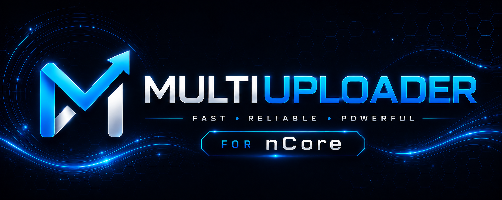
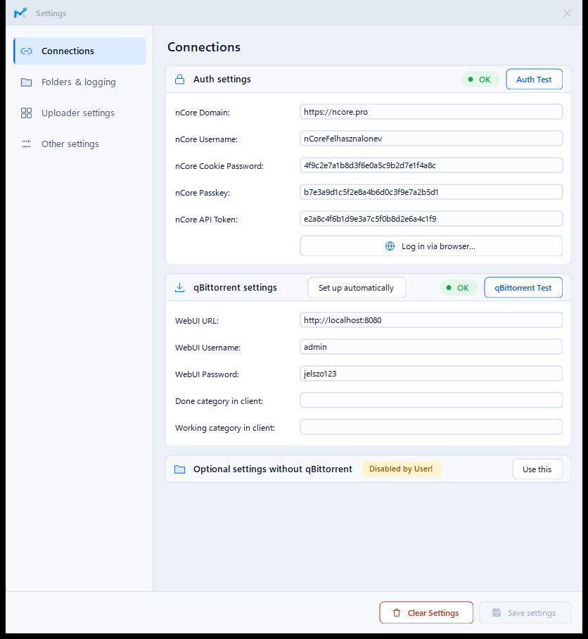
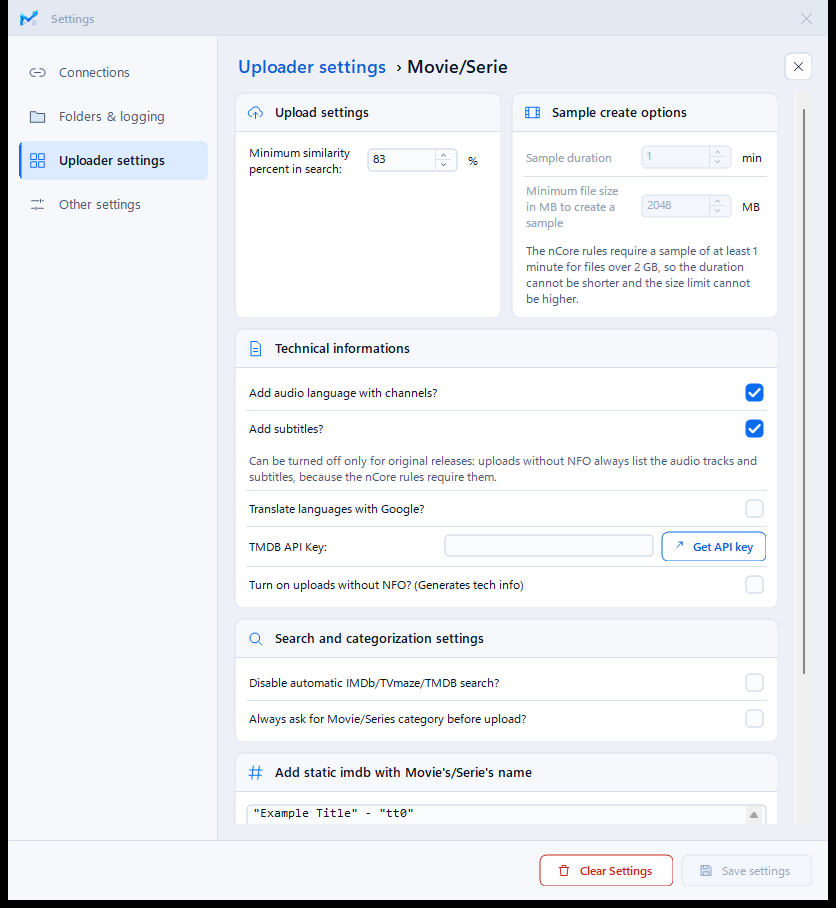
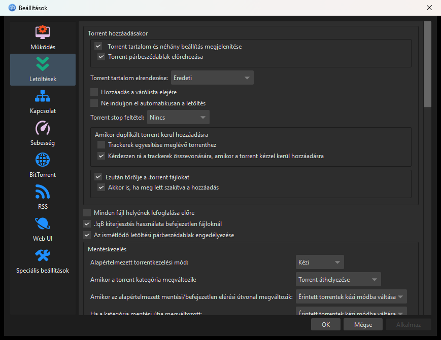
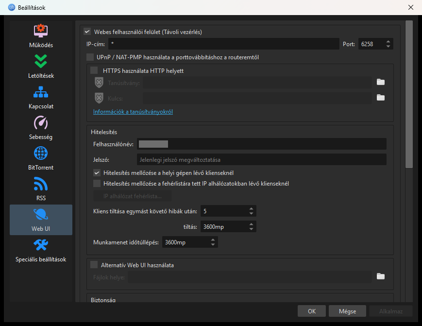
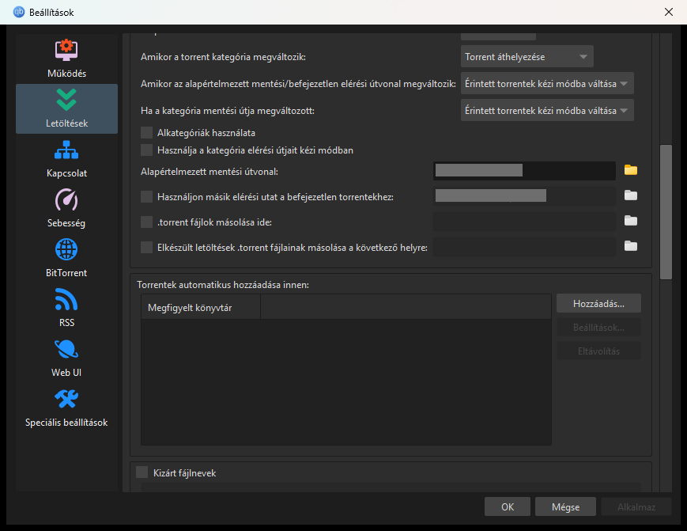
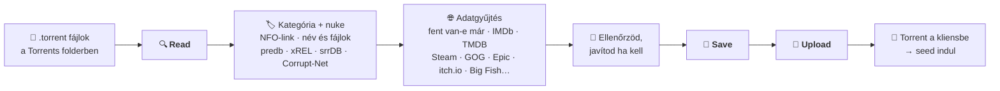
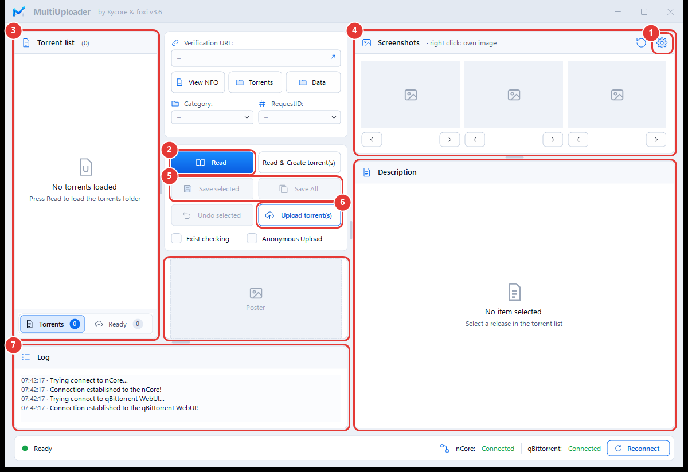
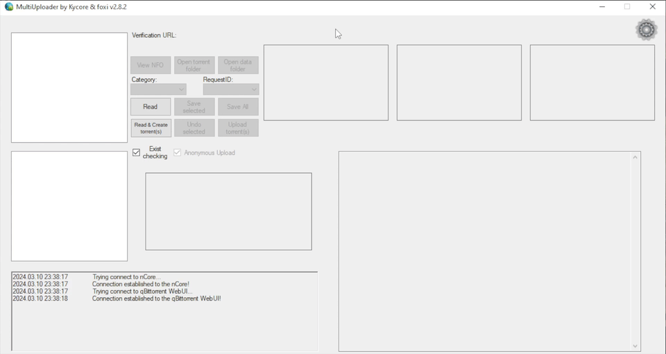
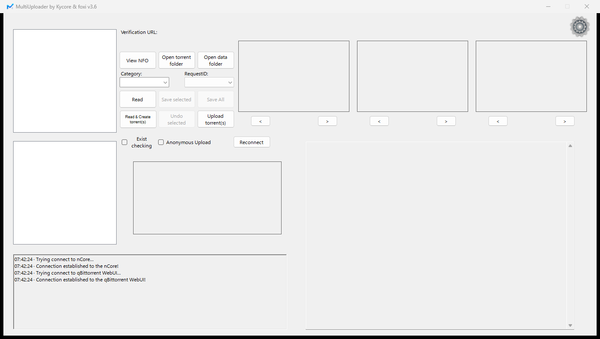

# MultiUploader for nCore

**Beolvassa a .torrent fájlt, összegyűjti hozzá a netről a leírást, képeket és adatokat, kitölti az nCore feltöltő űrlapját – te csak ellenőrzöl és rányomsz az Upload gombra.**

 

 

🎬 Film &nbsp;•&nbsp; 📺 Sorozat &nbsp;•&nbsp; 🎮 Játék &nbsp;•&nbsp; 🕹️ Konzol &nbsp;•&nbsp; 💿 Program &nbsp;•&nbsp; 📱 Mobil &nbsp;•&nbsp; 🎵 Zene &nbsp;•&nbsp; 🎤 Klip &nbsp;•&nbsp; 📖 Könyv &nbsp;•&nbsp; 🔞 XXX

 

<a href="#-mi-ez">Mi ez?</a> &nbsp;•&nbsp;
<a href="#-mire-van-szükséged">Mire van szükséged?</a> &nbsp;•&nbsp;
<a href="#-beállítás-6-lépésben">Beállítás</a> &nbsp;•&nbsp;
<a href="#-az-első-feltöltés">Első feltöltés</a> &nbsp;•&nbsp;
<a href="#-kategóriák">Kategóriák</a> &nbsp;•&nbsp;
<a href="#-haladó-beállítások">Haladó</a> &nbsp;•&nbsp;
<a href="#-hibaelhárítás">Hibaelhárítás</a> &nbsp;•&nbsp;
<a href="#-ismert-hibák">Ismert hibák</a> &nbsp;•&nbsp;
<a href="#-változásnapló">Változásnapló</a>

📷 Főablak (<a href="docs/main_light.png">világos</a> · <a href="docs/main_dark.png">sötét</a>) &nbsp;·&nbsp; 📷 Beállítások (<a href="docs/settings_light.png">világos</a> · <a href="docs/settings_dark.png">sötét</a>) &nbsp;·&nbsp; 🎞️ <a href="docs/sample.gif">Működés közben (GIF)</a>

 

## ✨ Mi ez?

Ha feltöltesz nCore-ra, ismered a menetet: megnyitod a feltöltő oldalt, kikeresed az IMDb linket, a leírást, a borítót, mintaképeket készítesz, kitöltöd a technikai adatokat, kiválasztod a kategóriát… **minden egyes release-nél.** A MultiUploader ezt csinálja meg helyetted – odaadsz neki egy mappát a `.torrent` fájlokkal, és:

<table align="center">
  <tr>
    <td align="center" width="33%">
      <h3>🔍</h3>
      <b>Felismeri</b> 
      Film, sorozat, játék, program, zene, könyv, XXX – és a pontos nCore kategória (HD/SD, ISO/RIP, MP3/Lossless…)
    </td>
    <td align="center" width="33%">
      <h3>🌐</h3>
      <b>Összegyűjti</b> 
      Leírás, borító, IMDb · TMDB · Steam · GOG · Epic · itch.io · Big Fish · MusicBrainz adatok, előadó és tracklista, ISBN – attól függően, mi a tartalom
    </td>
    <td align="center" width="33%">
      <h3>🖼️</h3>
      <b>Mintaképeket készít</b> 
      A videóból, a könyvből vagy a játék oldaláról, és feltölti őket képtárhelyre
    </td>
  </tr>
  <tr>
    <td align="center">
      <h3>📝</h3>
      <b>Kitölti</b> 
      Az nCore feltöltő űrlapját: cím, kategória, leírás, infobar kép, technikai infók, IMDb link
    </td>
    <td align="center">
      <h3>✅</h3>
      <b>Ellenőrzi</b> 
      Nincs-e már fent ugyanez a release, nem nuked-e, van-e rá nyitott kérés
    </td>
    <td align="center">
      <h3>🚀</h3>
      <b>Feltölti</b> 
      Egy gombnyomással, akár több tucatot egymás után – és a kész torrentet átadja a kliensednek, indul a seed
    </td>
  </tr>
</table>

<i>Minden adat a beolvasás után szerkeszthető a programban, mielőtt bármi felmenne az oldalra.</i>

| 🆕 Új vagy? | 🔧 Már használod? | 🆘 Elakadtál? |
|:---:|:---:|:---:|
| [Beállítás 6 lépésben](#-beállítás-6-lépésben) → [Első feltöltés](#-az-első-feltöltés) | [Kategóriák](#-kategóriák) · [Haladó beállítások](#-haladó-beállítások) · [Testreszabás](#-testreszabás) | [Hibaelhárítás](#-hibaelhárítás) |

 

## 🧩 Mire van szükséged?

| | Mi | Miért | Honnan |
|:---:|---|---|---|
| 🪟 | **Windows 10 vagy 11** | A program Windows-os asztali alkalmazás | – |
| ⚙️ | **.NET 10 Desktop Runtime** | A program ezzel fut | Ha hiányzik, a telepítő letölti és telepíti |
| 👤 | **nCore fiók** | Erre a fiókra fog feltölteni | – |
| 🎬 | **TMDB API kulcs** *(csak filmhez/sorozathoz)* | Innen jönnek a filmadatok, ingyenes, 3 perc regisztráció | [themoviedb.org](https://www.themoviedb.org/settings/api/request) – lásd a [3. lépést](#3-tmdb-kulcs--csak-filmhez-és-sorozathoz) |
| 🧲 | **qBittorrent** *(nem kötelező)* | Ha használod, a program feltöltés után automatikusan hozzáadja a torrentet és indul a seed | [qbittorrent.org](https://www.qbittorrent.org/) |

> [!NOTE]
> Minden mást a program **maga intéz**: a beépített böngészőhöz szükséges WebView2 futtatókörnyezetet és a mintaképekhez szükséges FFmpeg-et első használatkor letölti és telepíti.

 

## 🚀 Beállítás 6 lépésben

> [!TIP]
> Kb. **10 perc**, egyszer kell megcsinálni. A sorrend számít: előbb a belépés, aztán a többi.

### 1️⃣ Telepítés

1. Töltsd le a legfrissebb `MultiUploader_Setup_x.x.exe` fájlt a repó [Releases](../../releases/latest) füléről.
2. Indítsd el, Tovább → Tovább → Befejezés. A program a Start menübe kerül. Ha a gépen nincs .NET 10 Desktop Runtime, a telepítő az elején felajánlja, hogy letölti és telepíti (kb. 60 MB, a Microsoft oldaláról); **Nem** esetén a telepítő kilép.

   > [!TIP]
   > A .NET biztonsági javításait a Windows Update hozza, ha a *Beállítások → Windows Update → Speciális beállítások* alatt a **Frissítések fogadása más Microsoft-termékekhez** be van kapcsolva. Ehhez nem kell új MultiUploader-verzió.
3. Indítsd el a MultiUploadert, majd kattints a jobb felső sarokban a **⚙️ fogaskerékre** – ez a Beállítások.

> [!NOTE]
> A programnak **két megjelenítési módja** van: a **Modern** (ha a képernyőn elfér, ez az alapértelmezett) és a klasszikus **Simple** felület. A leírás a Modern felületet mutatja, ahol a Simple eltér, azt külön jelzi. Hogy mi a különbség és hogyan válthatsz (a Modernben világos és sötét téma is van), lásd a [Testreszabás](#-testreszabás) részt.

### 2️⃣ Bejelentkezés nCore-ra

A Beállítások ablak **Connections** oldalán az **Auth settings** kártya kell most (Simple felületen az ablak felső része).

📷 <i>Képernyőkép: Beállítások ablak</i>

 

<picture><source media="(prefers-color-scheme: dark)" srcset="docs/settings_dark.png"></picture>

1. Kattints a **`Log in via browser...`** gombra.
2. Megnyílik egy ablak az nCore bejelentkező oldalával. Jelentkezz be úgy, ahogy szoktál.
3. Az ablak magától bezárul, és a program **kitölti** a *nCore Username*, *nCore Cookie Password*, *nCore Passkey* és *nCore API Token* mezőket. Ezekhez nem kell hozzányúlnod.
4. Kattints az **`Auth Test`** gombra – ha mellette **zöld OK** jelenik meg (Simple felületen zöld pipa), kész.

> [!IMPORTANT]
> Belépésnél **pipáld be a „Ne léptessen ki” opciót**, különben a bejelentkezésed pár óra után lejár, és a program nem tud majd feltölteni.

🔧 <i>Kézi kitöltés, ha a böngészős belépés nem működne</i>

 

* **Cookie Password:** Chrome-ban, az nCore belépő oldalán kapcsold be a `Csökkentett biztonság` opciót, lépj be, majd F12 → [itt találod](https://i.kek.sh/BwsW6ykghEC.png).
* **API Token:** nyisd meg pl. a [Prémium](https://ncore.pro/shop) oldalt, F12 → [itt találod](https://i.kek.sh/y00g5YkHcPL.png). 60 napig érvényes.
* **Passkey:** a profilodban, a „Saját Passkey” sorban.
* **nCore Domain:** alapból `https://ncore.pro`, csak akkor írd át, ha más címen éred el az oldalt.

A mezőkbe **ne írj idézőjelet** – ha mégis, a program kitörli.

### 3️⃣ TMDB kulcs – csak filmhez és sorozathoz

1. Regisztrálj a [themoviedb.org](https://www.themoviedb.org/signup) oldalon (ingyenes).
2. Nyisd meg az [API igénylő oldalt](https://www.themoviedb.org/settings/api/request), válaszd a **Developer** típust, töltsd ki az űrlapot (személyes használatra bármit írhatsz, pl. alkalmazás neve: *MultiUploader*, URL: *none*).
3. Másold ki az **API Key** *(v3 auth)* értéket.
4. A Beállításokban nyisd meg az **Uploader settings** oldalt, kattints a **Movie/Serie** csempére, és illeszd be a kulcsot a **TMDB API Key** mezőbe. (Simple felületen: **`Movie/Serie Uploader settings`** gomb alul, majd **`Submit`**.)

Kulcs nélkül csatlakozáskor a program megkérdezi, használod-e a film- és sorozatfeltöltést TMDB nélkül. Ha igen, működik, csak a találatok pontatlanabbak (a TMDB-ből nem jön magyar cím és leírás); ha nem, a film/sorozat feltöltés ki van kapcsolva. Auto upload módban nem kérdez, ott kulcs nélkül ki van kapcsolva.

📷 <i>Képernyőkép: Movie/Serie settings</i>

 

<picture><source media="(prefers-color-scheme: dark)" srcset="docs/movie_settings_dark.png"></picture>

### 4️⃣ A két mappa

A Beállítások **Folders & logging** oldalán (Simple felületen az *Other settings* részben):

| Mező | Mit adj meg | Példa |
|---|---|---|
| 📁 **Torrents folder** | A mappa, ahol a feltöltendő `.torrent` fájlok vannak | `E:\Feltöltendő` |
| 📂 **Torrent data folder** | A mappa, ahol a letöltött release-ek **mappái** vannak (a program ezekben keresi az NFO-t és a videót/könyvet a mintaképekhez) | `E:\Torrentek` |

### 5️⃣ Torrent kliens – nem kötelező

Feltöltés után a program letölti az nCore-ról a kész torrentet, és kétféleképpen adhatja át a kliensnek: a qBittorrent **WebUI**-ján keresztül, vagy egy **figyelt mappába** (*Watch folder*) mentve. A Beállítások ablak első megnyitásakor megkérdezi, melyiket választod (*Do you want to use qBittorrent WebUI…?*): **Yes** → a `qBittorrent settings` doboz él, **No** → az `Optional settings without qBittorrent`; a másik doboz *Disabled by User!* jelzést kap (Modernben összecsukódik, csak a fejléce látszik, Simple felületen kiszürkül). Később a letiltott doboz **`Use this`** gombjával válthatsz át rá, majd **`Save settings`** – a program ilyenkor újracsatlakozik.

**🧲 qBittorrent – mindkét módhoz** (*Eszközök → Beállítások… → Letöltések*):

* **Alapértelmezett mentési útvonal** = a MultiUploader **Torrent data folder**-e. A program nem ad meg mentési helyet, a qBittorrent ide teszi a torrentet, és itt kell megtalálnia a release mappáját.
* **Torrent tartalom elrendezése:** *Eredeti* – a másik két beállítás más mappaszerkezetet vár, mint ami a lemezen van.
* **Ne induljon el automatikusan a letöltés** legyen kikapcsolva, különben a torrent megállítva kerül be, és nem indul a seed.

📷 <i>Képernyőkép: qBittorrent – Letöltések</i>

 

**🌐 qBittorrent WebUI-val** – `qBittorrent settings` doboz:

**Automatikusan** (ha a qBittorrent ugyanezen a gépen fut): kattints a **`Set up automatically`** gombra. A program megkeresi a qBittorrent beállításfájlját (ha nem találja, rákérdez a `qBittorrent.ini` helyére), és ha a WebUI még nincs bekapcsolva, megkér, hogy lépj ki a qBittorrentből – az ablak bezárása nem elég, a tálcaikonon jobb klikk → **Kilépés**. Ezután biztonsági mentést készít (`qBittorrent.ini.bak`), bekapcsolja a WebUI-t a **Hitelesítés mellőzése a helyi gépen lévő klienseknél** opcióval (jelszót csak akkor állít be, ha még nincs), újraindítja a qBittorrentet, kitölti a **WebUI URL** mezőt, lefuttatja a `qBittorrent Test`-et, és kiírja, sikerült-e. Utána már csak a **Save settings** kell.

**Kézzel:**

1. qBittorrentben: *Eszközök → Beállítások… → Web UI*, pipáld be a **Webes felhasználói felület (Távoli vezérlés)** opciót.
2. Jegyezd meg a **Port**ot, a *Hitelesítés* részben adj meg **Felhasználónevet** és **Jelszót**, majd **OK**. Ha a qBittorrent ugyanezen a gépen fut, elég bepipálni a **Hitelesítés mellőzése a helyi gépen lévő klienseknél** opciót – ilyenkor felhasználónév és jelszó nem kell.
3. A MultiUploaderben írd be a **WebUI URL** (`http://localhost:<port>`, ha a qBittorrent másik gépen fut, annak IP-címével), **Username** és **Password** mezőket (a hitelesítés mellőzésénél ez a kettő üresen maradhat). A **Done category** és **Working category** mezőt hagyd üresen – ezek nem szükségesek, lásd [Haladó beállítások](#-haladó-beállítások).
4. Kattints a **`qBittorrent Test`** gombra – zöld OK (Simple felületen zöld pipa) = jó. Ha a qBittorrent alapértelmezett mentési útvonala eltér a *Torrent data folder*-től, a program felajánlja, hogy átírja – válaszd a **Yes**-t.

A program hash-ellenőrzés nélkül adja hozzá a torrentet (a fájlok már a helyükön vannak), így **azonnal indul a seed**.

📷 <i>Képernyőkép: qBittorrent – Web UI</i>

 

**📁 Figyelt mappával** – `Optional settings without qBittorrent` doboz:

1. Adj meg egy üres mappát a **Watch folder** mezőben (pl. `E:\Watch`).
2. qBittorrentben: *Eszközök → Beállítások… → Letöltések*, lent a **Torrentek automatikus hozzáadása innen** résznél **Hozzáadás…**, válaszd ki ugyanezt a mappát, majd **OK**.

A program feltöltés után `<torrent azonosító>.torrent` néven ide menti a kész torrentet, a qBittorrent felveszi, ellenőrzi a meglévő fájlokat, és indul a seed. Más kliens (uTorrent, Deluge…) is így használható: a saját figyelt mappáját add meg.

📷 <i>Képernyőkép: qBittorrent – figyelt mappa</i>

 

**🚫 Ha egyiket sem akarod:** hagyd üresen, a program akkor is feltölt, csak a seedet kézzel kell indítanod.

### 6️⃣ Mentés

Kattints a **`Save settings`** gombra. Kész – a program használatra kész! 🎉

 

## 🎬 Az első feltöltés

```mermaid
flowchart LR
    A[📁 .torrent fájlok<br/>a Torrents folderben] --> B[🔍 <b>Read</b>]
    B --> C[🏷️ Kategória + nuke<br/>NFO-link · név és fájlok<br/>predb · xREL · srrDB · Corrupt-Net]
    C --> D[🌐 Adatgyűjtés<br/>fent van-e már · IMDb · TMDB<br/>Steam · GOG · Epic · itch.io · Big Fish…]
    D --> E[👀 Ellenőrzöd,<br/>javítod ha kell]
    E --> F[💾 <b>Save</b>]
    F --> G[🚀 <b>Upload</b>]
    G --> H[🧲 Torrent a kliensbe<br/>→ seed indul]
```

A számok a főablak képén lévő jelölőkre utalnak – nyisd le:

📷 <i>Képernyőkép: főablak a lépések számaival</i>

 

<picture><source media="(prefers-color-scheme: dark)" srcset="docs/main_dark.png"></picture>

1. ⚙️ **Beállítások** (fogaskerék) – ezt már megcsináltad fent.
2. 🔍 **`Read`** – a program beolvassa a *Torrents folder* összes `.torrent` fájlját, kikeresi hozzájuk az adatokat a netről, és megnézi, nincs-e már fent az oldalon. Ha egy release-hez nincs NFO, megkérdezi, letöltse-e a pre-adatbázisból vagy az [srrDB](https://www.srrdb.com/)-ről; ha nem biztos a kategóriában, egy kis ablakban rákérdez.
3. 📋 **A beolvasott release-ek listája** – kattints egyre, és a jobb oldalon megjelenik minden, amit a program összegyűjtött róla. A **Tab** / **Shift+Tab** a következő / előző release-re lép, a lista végéről körbe az elejére; csak az éppen használt listán belül mozog (a *Torrents* és a *Ready* lista között – Simple felületen a két lista között – nem ugrik át). Ha egy release-t ki akarsz venni, jobb klikk → **Remove from the list** – a program előtte megerősítést kér, a **No** mindent úgy hagy. Ugyanebben a jobb klikkes menüben adhatod meg vagy cserélheted az IMDb-azonosítót (*Add / Change IMDb ID*), a játék azonosítóját (*Add / Change GameID*), zenénél és könyvnél a műfajt (*Add / Change genre*), állíthatod vissza az előző azonosítót (*Reset to previous ID*), és szerkesztheted az infobar címeit (*Edit infobar titles*).
4. 👀 **Nézd át, javítsd ha kell** – a három mintakép és az infobar kép (jobb klikk → saját kép), a leírás (szabadon szerkeszthető), a kategória legördülő.
5. 💾 **`Save selected`** (vagy `Save All`, ha mind jó) – a release átkerül a feltöltendők közé: a lista alján a **Ready** fülre (Simple felületen a bal alsó listába). A release-ek a beolvasás sorrendjében kerülnek át, és a program ebben a sorrendben is tölti fel őket. Az **`Undo selected`** a kijelölt mentett release-t visszateszi a beolvasottak közé.
6. 🚀 **`Upload torrent(s)`** – a program egyesével feltölti őket (köztük legalább 5 mp szünettel), majd a kész torrentet átadja a kliensnek vagy a figyelt mappába teszi.
7. 📜 **Napló** – itt látod, mi történik, és ha valami nem sikerül, itt írja ki, miért.

> [!TIP]
> A **`Read & Create torrent(s)`** gombbal a `.torrent` fájlt is elkészítheted a programban: kijelölöd a mappákat/fájlokat, választasz szeletméretet (vagy hagyod automatikusan), és a program elkészíti, majd rögtön be is olvassa.

> [!WARNING]
> A duplikáció-ellenőrzés azt nézi, hogy *pontosan ugyanez a release-név* fent van-e már. Ha ugyanaz a film más release-csoporttól már fent van, azt neked kell észrevenned.

🎞️ <b>Nézd meg működés közben</b> – <i>egy teljes beolvasás és feltöltés animált GIF-en (14 MB)</i>

 

<kbd></kbd>

 

## 📚 Kategóriák

A kategóriát a program ebben a sorrendben állapítja meg – az első forrás dönt, amelyik biztosat mond:

1. **Játék-link az NFO-ban** (Steam, GOG, Epic, itch.io, Big Fish) → játék.
2. **A release neve és a torrent fájllistája** – amit pre-adatbázis nélkül is el lehet dönteni: `MDVDR` / `MVID` / `MBLURAY` jelölés → zene; évad/epizód vagy dátum a névben videófájlokkal, illetve évszám + felbontás → film/sorozat (a zenei `-Év-ReleaseCsoport` végződés kivétel); `XXX` + `IMAGESET`, illetve `XXX` jelölés videófájlokkal → XXX; csak hangfájlok → zene; `EBOOK` a névben vagy könyvfájlok → könyv; mobil telepítő → mobil; konzol jelölés (`NSW`, `PS4`, `XBOX`…) → konzol játék; `GOG` a névben vagy a *Game Uploader settings*-ben boltra rendelt release-csoport → PC játék.
3. **Pre-adatbázisok:** [predb.club](https://predb.club) → [predb.net](https://predb.net) → [xREL](https://www.xrel.to) → [srrDB](https://www.srrdb.com/) (ha ott van IMDb-azonosítója → film/sorozat) → [Corrupt-Net](https://pre.corrupt-net.org/) szekció. A pre oldal szekcióját a torrent tartalmához méri: ha zenének mondja, de nincs benne hangfájl, nem fogadja el.
4. Ha egyik sem tud semmit, egy kis ablakban **rákérdez** (auto upload módban kihagyja a release-t).

Ha a Beállítások → *Other settings* → **Category selection** értéke *Manual*, a program minden release-nél megmutatja ezt az ablakot, és kiemeli benne az automatikusan talált kategóriát – elég jóváhagyni, vagy másikat választani. Auto upload módban ilyenkor is az automatikus kategória marad.

Ha rosszul sorolná be, beolvasás után szabadon átváltható. Minden besorolt release-t **nuke-ra is ellenőriz** – a pre-adatbázisban és a Corrupt-Neten –, a nuked release-t felajánlja törlésre; a visszavont nuke („unnuke”) nem számít nuke-nak. **Minden kategóriában** feltölthetsz saját infobar képet vagy mintaképet (jobb klikk a képen); az infobar képet a program méretre igazítja.

**nCore-szabályok:** beolvasáskor a program azt is megnézi, nem tiltja-e a release-t az nCore feltöltési szabályzata – XviD/DivX videó, x265 1080p alatt vagy 1080p-ben HDR/Dolby Vision nélkül (a Blu-ray anime kivétel), 2160p nem x265-tel, `.ts`/`.m2ts` fájl Blu-ray lemezszerkezeten kívül, NFO nélküli 480p (az anime kivétel), RAR-okra bontott release (csak PC játék és program RIP-nél megengedett), Early Access / Alpha / Beta (a GOG kivétel) és demó játék, XXX SD, 128 kbps alatti MP3. Ilyenkor megmutatja az okokat, és választhatsz: **`Upload anyway`** vagy **`Delete .torrent file`**; auto upload módban kihagyja a release-t. A `.txt` könyvet és a jelszóval védett PDF-et kérdés nélkül kihagyja, a naplóban jelzi.

🎬 <strong>Film és Sorozat</strong>

 

* **Kategória automatikusan:** film vagy sorozat (csak évszám → film; évad/epizód/dátum → sorozat), SD vagy HD.
* **IMDb keresés sorrendje:** NFO-ban lévő link vagy rögzített azonosító (lásd lent) → [srrDB](https://www.srrdb.com/) → [xREL](https://www.xrel.to) → [JustWatch](https://www.justwatch.com/) → cím alapján az IMDb-n. A JustWatch és a cím alapú keresés a beállított *Minimum similarity percent in search* egyezéssel dolgozik (alapértelmezés 90%); ha az NFO-ban TVmaze- vagy TheTVDB-link van, a JustWatch kimarad.
* A *Movie/Serie settings*-ben kikapcsolható az automatikus keresés (*Disable automatic IMDb/TVmaze/TMDB search?*), és kérheted, hogy beolvasáskor minden scene release-nél rákérdezzen a film/sorozat kategóriára (*Always ask for Movie/Series category before upload?*; auto upload módban nem kérdez).
* Az NFO-ban lévő IMDb-link és a kézzel megadott vagy statikus IMDb-azonosító mindenhol az alap. A többi forrásból (TVmaze/TMDB/TheTVDB link, srrDB, xREL) kapott azonosítót az IMDb-ről azonosító alapján kéri le, és a címét (AKA-listával együtt) a release nevéhez méri: ha egyik cím sem egyezik **és** a cím alapú keresés másik azonosítót talál, azt veszi; ha a keresés nem talál mást, a linkelt azonosító marad.
* **Az adatok forrása, a legmegbízhatóbbtól:** az infobar adatait az IMDb adja azonosító alapján (egy lekérdezés), a többi forrás csak azt tölti ki, amit az IMDb nem ad. Kivétel az angol cím: nem angol nyelvű produkciónál az IMDb főcíme gyakran az eredeti cím vagy egy másik változat (*Kirik Hayatlar* – *Broken Lives*, *A Night's Tale* – *The Nightfall*), ezért ott a TVmaze GB/US AKA-ja és a TMDB angol fordítása előrébb áll; az IMDb címe akkor kerül be, ha ezek nem adtak angol címet, vagy ha ugyanazt adja bővebben (*Tougen Anki* – *Tougen Anki: Dark Demon of Paradise*). A TMDB magyar neve csak akkor számít magyar címnek, ha nem az eredeti cím (magyar produkciónál az).

  | Mező | 1. | 2. | 3. | 4. |
  |---|---|---|---|---|
  | Angol cím | TVmaze GB/US AKA | TMDB (angol fordítás) | IMDb | nCore IMDb-segéd |
  | Magyar cím | IMDb magyar AKA | TVmaze magyar AKA | nCore IMDb-segéd | TMDB (magyar) |
  | Eredeti cím | IMDb (latin betűs, pl. *Gisaengchung*) | nCore IMDb-segéd | JustWatch | TMDB |
  | Év, értékelés, ország | IMDb | nCore IMDb-segéd | TVmaze | – |
  | Rendező, szereplők | IMDb (rendező híján az alkotók, pl. sorozatnál) | nCore IMDb-segéd | – | – |
  | Hossz | IMDb | TVmaze | nCore IMDb-segéd | – |
  | Műfajok | IMDb (az nCore magyar neveivel) | nCore IMDb-segéd | TMDB (magyar) | – |
  | Infobar kép | IMDb | TVmaze | TMDB | nCore IMDb-segéd |
  | Leírás (plot) | port.hu | mafab.hu | TMDB (magyar) | JustWatch → TMDB (angol) → TVmaze → IMDb (angol) |

  Ha az IMDb-n nincs értékelés, az értékelés `0` lesz (ahogy az nCore-on is), a TVmaze pontszáma nem kerül a helyére. Az nCore IMDb-segédje (`imdb_movie` ajax) csak akkor fut, ha az IMDb nem válaszol, vagy ha egy műfajnak nincs magyar neve – ilyenkor csak a műfajokat kéri onnan. A műfajok nCore-os magyar neveit a program tanulja is: 30 naponta egyszer (és minden ilyen segéd-lekérésnél) összeveti az IMDb műfajait az nCore szavaival, az eltérést eltárolja (`%AppData%\MultiUploader\imdb-genres.json`) és a naplóban jelzi – a beépített szótárt nem kell kézzel frissíteni.
* Az NFO-ban talált egyéb linkeket (TVmaze, TheTVDB, Rotten Tomatoes, mafab, port.hu, MyAnimeList, Netflix) is beteszi a feltöltésbe.
* Ha az IMDb magyar címe egyezik a release nevével, az infobarba az angol cím kerül eredeti/magyar címként. Idegen nyelvű release-nél magyar cím nélkül az eredeti/magyar címhez az eredeti cím kerül (*Kodenavn Hunter*).
* **3 mintakép** a film elejéről (alapból a hossz 5, 7 és 9%-ánál; évadpack esetén az első epizódból). A *Thumbnail picture's settings*-ben állítható a helyük, a fekete/fehér kockák kiszűrése, hogy kerüljön-e **6 véletlen kép** a leírásba, és hogy egyszerre hány ffmpeg mintakép készülhessen (*Parallel ffmpeg snapshots*, alapértelmezés 3, 1 és 8 között) – ez utóbbi a film és a lemez terhelését osztja be, nem a képek számát. HEVC videónál a kockát a videókártya dekódolja. Az *FFmpeg for the thumbnails* beállításban választható, melyik FFmpeg töltődjön le: a **Full** (~60 MB, alapértelmezés) a HDR10, HLG és Dolby Vision filmek mintaképét a videókártyán SDR-re képezi le (libplacebo, Vulkan), így az eredetihez hű színeket ad; az **Essentials** (~35 MB, kisebb letöltés) ezt nem tudja, ezért azokon a filmeken a mintakép fakó, a Dolby Vision Profile 5-ösöknél lila-zöld. Normál (SDR) videónál a kettő ugyanazt a képet adja.
* A leírásba kerülő képek a kek.sh-ra töltődnek. Ha a kek.sh nem válaszol, és a *Thumbnail picture's settings* jobb oldali oszlopában (Modern felületen az **API keys (optional)** kártyán) meg van adva egy ingyenes **imgbb API Key**, a képek az imgbb-re kerülnek. A kulcs nem kötelező; nélküle minden a régi módon megy.
* Ha egy megadott opcionális API-kulcsot (Google Books, imgbb) a szolgáltatás elutasít, a program abban a munkamenetben nélküle megy tovább, és egyszer szól: kézi módban megkérdezi, törölje-e a kulcsot a beállításokból; AutoUpload alatt egy OK-gombos ablak jelzi, ami nem állítja meg a feltöltést.
* **Technikai infó** opcionálisan a leírásba: hangsávok, feliratok nyelve – magyarra fordítva vagy bekérve.
* **Nem scene release** (saját rip, NFO nélkül): bekapcsolható (*Movie/Serie settings* → *Turn on uploads without NFO?*), csak kézi beolvasással – auto upload módban nem –, és csak akkor, ha a torrentben kizárólag `.mkv`, `.avi`, `.mp4` vagy `.wmv` videó és felirat van; lemezkép (pl. DVD ISO) vagy DVD-mappa nem lehet benne. Ha nincs NFO, a program megkérdezi, hogy keressen-e hozzá, vagy a saját MediaInfójával töltse fel; ez utóbbinál maga generálja a MediaInfót, bekéri a címet és a torrent nevét, filmnél **sample fájlt** is készít – a scene szokását követve külön `sample` mappába (a *Sample create options* szerint, a megadott méret fölötti fájloknál). HD filmnél 2 GB fölött az nCore szabálya kötelezővé teszi: ha a sample nem sikerül, a program megkérdezi, próbálja-e újra, töltse-e fel nélküle, vagy törölje a `.torrent` fájlt. Megadhatsz IMDb- vagy TVmaze-linket: ilyenkor pontos találattal egészíti ki az adatokat, és ha sportesemény, magától sorozat kategóriába kerül, generált epizódszám nélkül, sport-infobarral. Sporteseménynek a TVmaze *Sports* műsorait veszi, és ha a TVmaze nem ismeri (pl. UFC), akkor az olyan IMDb-tételt, amely tévéműsor/-epizód/-különkiadás és az egyetlen műfaja a *Sport* – a sportfilmek és -dokumentumfilmek más műfajt is hordoznak, azok filmek maradnak. Link nélkül a beírt cím alapján keres az IMDb-n, a TVmaze-en és a TMDB-n (a release-névre épülő srrDB / xREL / JustWatch itt értelemszerűen kimarad).

<i>Rossz IMDb-t talál egy sorozathoz?</i>

 

Rögzítsd a *Movie/Serie settings → Add static imdb with Movie's/Serie's name* mezőben, pl.:

> "The Voice AU" - "tt2334429" 
> "The Block AU" - "tt0418372" 
> "Insight AU" - "tt1604928" 
> "World War Two Battles Won And Lost" - "tt9394316" 
> "Gruen" - "tt5957238"

Ha egy release-nél jobb klikkel (*Change IMDb ID*) kézzel adod meg az IMDb-azonosítót, a program felajánlja, hogy a címet és az azonosítót ebbe a listába is elmentse – legközelebb ennél a címnél már magától ezt használja. A kérdésnél bejelölheted, hogy jegyezze meg a választásodat és ne kérdezzen többet; ezt a *Save a manually given IMDb ID* beállításban (*Ask* / *Always save* / *Never save*) bármikor visszaállíthatod.

🎮 <strong>PC és Konzol játék</strong>

 

* **Kategória automatikusan:** ISO / RIP, a konzol kategóriát név vagy predb alapján dönti el.
* Ha az NFO-ban **Steam, GOG, Epic, itch.io vagy Big Fish** link van, biztosan játék kategória lesz, és az adatok abból a boltból jönnek.
* **Öt bolt:** Steam, GOG és Epic linkből vagy név alapján kereséssel; **itch.io és Big Fish csak linkből** (NFO-ból vagy a bekérő ablakban megadva) – ott a név alapú keresés túl sok hamis találatot adna (rajongói játékok ugyanazzal a címmel, nyelvi duplikátumok).
* **Az adatok a boltból:** leírás, rendszerkövetelmény, 3 kép a bolt képernyőképeiből (a képek melletti nyilakkal léptethető, amíg van még kép) és az infobar kép. YouTube videó és igazoló link is hozzáadható. Ha a bolt nem közöl rendszerkövetelményt (itch.io), a szakasz kimarad a leírásból. Big Fish linknél a release platformjának (Windows / Mac) megfelelő változatot tölti be, ha van olyan.
* **Név alapú keresés** (*Game Uploader settings → Select search type*): *Auto determinate by name/nfo* – Steam → GOG → Epic sorrendben, de ha a névben `GOG` van, a GOG az első; *Search by release groups* – a *Search this release on Steam / GoG / Epic* listákba írt release-csoportok a saját boltjukban indulnak, utána a többi jön (egy release-csoport csak egy listában szerepelhet, ütközésnél a mentés megnevezi); *Search only on Steam / GoG / Epic* – csak az egyik bolt; *Steam → GoG → Epic* (és a GoG, illetve Epic kezdetű változat) – a választott bolt után a másik kettő az alap Steam → GOG → Epic sorrendben; *Disabled*. Minden boltot legfeljebb egyszer kérdez le release-enként, a találathoz a *Minimum similarity percent* egyezés kell.
* **DLC-release:** mindig az alapjáték adatait kapja (pl. `Stellaris_Utopia` → Stellaris, `Fallout_4_Far_Harbor` → Fallout 4). Ha a bolt magát a DLC-t nem találja, a név végéről legfeljebb 5 szót elhagyva keresi az alapjátékot; ilyenkor a bolti cím végén álló kiadásjelölő (pl. *Remastered*, *Game of the Year Edition*) nem számít. A sorszám nem maradhat le: az `Alan_Wake_2_Night_Springs` nem kapja meg az első Alan Wake-et.
* A leírás elemei (mit tegyen bele) a *Game Uploader settings*-ben kapcsolhatók.
* Ha sem linket, sem találatot nem talál: beállítástól függően **bekéri** a bolt linkjét (az ablakban Steam / GoG / Epic / itch.io / Big Fish keresőlink segít), vagy **üresen** tölti fel (opcionális sablonnal).
* A „Telepítés” szakasz szövege release-csoportonként testreszabható – lásd [lent](#-testreszabás).
* **Nem scene release** (NFO nélkül) nem tölthető fel: NFO kell – a torrentben, vagy név alapján megkeresi a pre-adatbázisokban; ha nincs, a naplóban jelzi és kihagyja a release-t.

💿 <strong>Program és Mobil</strong>

 

* **Kategória automatikusan:** ISO / RIP / Mobil.
* Ha az NFO-ban talál linket, a leírás végére beszúrja *(kikapcsolható)*.
* **Nem scene release** (NFO nélkül) nem tölthető fel: NFO kell – a torrentben, vagy név alapján megkeresi a pre-adatbázisokban; ha nincs, a naplóban jelzi és kihagyja a release-t.

🎵 <strong>Zene és Klip</strong>

 

* **Kategória automatikusan:** MP3 / Lossless / Klip.
* **Stílus:** a fájlból, vagy a pre oldalról; ha egyik sem ad, bekéri.
* Zenénél **teljes leírás**: előadó, albumcím, tracklista *(kikapcsolható)*; albumborító a fájlból *(kikapcsolható)*. Ha a fájlban nincs borító, a címkék (album, előadó) alapján a MusicBrainz-ből keresi meg, és a Cover Art Archive-ból tölti le. Kulcs nem kell hozzá, és csak egyértelmű találatot fogad el.
* Ha az NFO-ban talál linket, a leírás végére beszúrja *(kikapcsolható)*.
* **Nem scene release:** bekapcsolható (*Music/Clip settings* → *Turn on uploads without NFO?*), csak kézi beolvasással – auto upload módban nem. Zenénél a torrentben csak MP3 vagy lossless hangfájl lehet (kísérőfájlokkal, képekkel). Klipnél csak `.mkv`, `.avi`, `.mp4` vagy `.wmv` videó és felirat, és ehhez a *Movie/Serie settings*-ben is be kell kapcsolni; ilyenkor a program megkérdezi, hogy film/sorozat vagy klip legyen. A program generálja a MediaInfót, bekéri az igazoló linket, extrákat és a torrent nevét; klipnél a filmhez hasonlóan sample fájlt is készít.

📖 <strong>Könyv</strong>

 

* **Nyelv automatikusan** (magyar / külföldi) a release nevéből.
* **Műfaj:** a pre oldalról; ha az NFO-ban ISBN van, a Google Books kategóriái magyarra fordítva kiegészítik; magazinnál és képregénynél a release nevéből; ha egyik sem ad, bekéri.
* **ISBN** (az NFO-ból) alapján a Google Books-ról leírást (író, cím, kiadás dátuma) és – ha nincs más – borítót is tölt *(kikapcsolható)*. Ha a Google nem ad adatot, az Open Library-ból próbálja (cím, író, kiadás éve, borító – műfajt onnan nem vesz át).
* **Google Books API kulcs** *(nem kötelező)*: kulcs nélkül a program minden felhasználója a Google közös napi keretén osztozik, ami gyakran elfogy, és ilyenkor az ISBN-adat üres marad. Saját, ingyenes kulccsal napi 1000 lekérés jár: a [Google Cloud Console](https://console.cloud.google.com/apis/library/books.googleapis.com)-ban hozz létre egy projektet, engedélyezd a *Books API*-t, majd a *Credentials* alatt készíts egy API kulcsot, és illeszd be a Beállítások **Uploader settings** oldalán az **Ebook** csempe **Google Books API Key** mezőjébe (Simple felületen: **`Ebook Uploader settings`** gomb). Ha a kulcs hibás, a program kulcs nélkül is megpróbálja.
* **Mintaképek** automatikusan: PDF, EPUB, CBZ, CBR, FB2, MOBI, AZW, AZW3, PRC, DOCX, XPS, OXPS, HTM, HTML.
* MOBI / AZW / AZW3 / PRC fájlból a borítót infobar képnek is használja.
* `.txt` könyvet és jelszóval védett PDF-et nem tölt fel (nCore-szabály), a naplóban jelzi.
* **Nem scene release** (NFO nélkül) nem tölthető fel: NFO kell – a torrentben, vagy név alapján megkeresi a pre-adatbázisokban; ha nincs, a naplóban jelzi és kihagyja a release-t.

🔞 <strong>XXX</strong>

 

* **Kategória automatikusan:** HD / SD / Imageset.
* **3 mintakép** a videó elejéről; videónál kérhetsz a videóból egy infobar képet is (*Should we create an infobar image for the movie XXX?*).
* Ha az NFO-ban talál linket, a leírás végére beszúrja *(kikapcsolható)*.
* Imageset esetén 3 véletlen képet tölt fel, és opcionálisan megkeresi a borítóképet (pl. `cover` vagy `poster` nevű fájl) az infobarhoz.
* **Nem scene release** (NFO nélkül) nem tölthető fel: NFO kell – a torrentben, vagy név alapján megkeresi a pre-adatbázisokban; ha nincs, a naplóban jelzi és kihagyja a release-t.

 

## ⚙️ Haladó beállítások

🧲 <strong>qBittorrent kategóriák</strong>

 

A kategóriák **nem szükségesek** a feltöltéshez és a seedhez: egyedi, plusz funkciók egy olyan munkafolyamathoz, ahol a qBittorrent kategóriákkal különíti el a még letöltődő és a feltöltésre kész release-eket. Ha nem így dolgozol, hagyd üresen mindkettőt.

* **Working category in client** – ha megadod, beolvasáskor megnézi ezt a kategóriát: ha a release itt megállítva van, és a *Done category*-ben nincs belőle megállított példány, kihagyja (*still in the progress*); ha a *Done category*-ben is megállítva van, a Working category-beli példányt törli a kliensből (a fájlokat nem), és beolvassa.
* **Done category in client** – ebből a kategóriából feltöltés után törli az eredeti torrentet, hogy ne legyen duplikáció a kliensben (az nCore-os példány veszi át a seedet).

A kategóriát legördülő mezőkből tudod kiválasztani: a **qBittorrent Test** lekéri a kliens kategóriáit, és ezek közül választhatsz (a lista a következő Testig megmarad). Az első Test előtt csak a már mentett kategóriák szerepelnek a listában. Ha a kliensben nincs egyedi kategória, és mentett sincs, a két mező meg sem jelenik.

🔎 <strong>Keresés kérésekben</strong>

 

`Enable request search on nCore?` – a beolvasás végén (és ha a kategóriát vagy az azonosítót átírod, újra) megkeresi, van-e nyitott **kérés** a release-re – auto upload módban nem keres –, és ha igen, hozzákapcsolja (a főablak *RequestID* mezőjében látod és átírhatod).

Két lépcsőben keres: először a pontos release-névre, majd – ha be van kapcsolva az `If the exact search didn't find anything, try using the game/movie name?` – a címre is (pl. `Shoresy.S01E06.720p.WEB.h264-KOGi` → `Shoresy`). Ez utóbbi téves találatot is adhat, **ellenőrizd, mielőtt feltöltöd** – a rossz kérésre feltöltött torrentet utólag már csak törölni lehet (vagy a kérő vonhatja vissza), a kérés azonosítóját módosítani nem lehet.

🤖 <strong>Auto upload mód</strong>

 

Az *Auto upload settings*-ben bekapcsolható **felügyelet nélküli** mód: a program adott időközönként figyeli a *Torrents foldert*, és minden új `.torrent`-et automatikusan beolvas és feltölt – kérdések nélkül.

* **Skip torrent if…** – mikor hagyja ki a release-t (hiányzik az NFO, hiányzik a release mappája, hiányzó epizód, hibás torrent-újragenerálás, hiányzó zene/könyv műfaj…).
* **If torrent exist/nuked** – mi legyen, ha már fent van vagy nuked.
* **Max retries after upload failure** – hányszor próbálja újra.
* **Upload game empty if no Steam/GOG link found?** – játéknál üresen töltse fel, ha nem talál adatot.
* **Check for updates every** – ebben a módban ennyi óránként nézi meg, van-e programfrissítés.
* **Max reconnect attempts** – ha megszakad az nCore-kapcsolat, a program a *Torrent's folder checking interval* ütemében magától újracsatlakozik; ennyi egymást követő sikertelen próbálkozás után kikapcsolja az auto upload módot (a beállításban is), és a naplóban jelzi, hogy kézzel kell újracsatlakozni.
* **If category is missing** – ha a PreDB még nem ismeri a release-t, a program kategória nélkül kihagyja. A *Retry only with the button* esetén csak a főablak **Retry skipped (no category)** gombja engedi vissza ezeket azonnal; a *Retry periodically* esetén a program a *Retry skipped torrents every* percenként, legfeljebb *Max retries per torrent* alkalommal magától is újra megpróbálja őket. A gomb a próbák elfogyása után is működik.

Ebben a módban a *Read* és a listák le vannak tiltva, a főablakon piros felirat jelzi, hogy aktív.

🧰 <strong>Egyéb</strong>

 

* **Exist checking** (főablak) – beolvasás előtt megnézi, mi van már fent, és eleve kihagyja azokat.
* **Anonymous Upload** (főablak) – névtelen feltöltés. Csak akkor jelenik meg, ha az nCore-rangod engedi (Feltöltő, Releaser, VIP, HelpDesk, Moderátor, Admin, Tulaj).
* **Reconnect** (főablak) – csak akkor jelenik meg, ha a legutóbbi nCore-kapcsolódás nem sikerült; ezzel lehet kézzel újracsatlakozni. Ha közben visszajön a hálózat, a program **magától** lefuttatja ugyanezt: a hálózati változás után 3 másodperccel (hogy a DHCP és a DNS beálljon); ha épp feltöltés, beolvasás, torrentkészítés vagy auto upload fut, megvárja, amíg végez. A naplóban jelzi, amikor megpróbálja.
* `Remove torrent file after uploaded?` – sikeres feltöltés után törölje-e a `.torrent` fájlt a *Torrents folderből*.
* `Always add release's name to description (length doesn't matter)?` – a release nevét mindig tegye a leírásba.
* `Ask for confirmation when exiting if the list is not empty or read in progress?` – kilépéskor rákérdez, ha van még release a listán, vagy fut a beolvasás.
* `Update checking` – nCore-kapcsolódáskor megnézi, van-e programfrissítés (alapból bekapcsolva).
* A feltöltések közti szünet minimum **5 másodperc**, feljebb állítható – lejjebb nem, mert nem akarjuk spammelni az nCore-t.
* `Logging` / `Log file location` – a napló fájlba is mehet: naponta új fájlt kezd, ha *Days to archive*-nál több napi fájl gyűlt össze, a régebbieket egy zip-be tömöríti, és legfeljebb *Max archives* archívumot tart meg.
* Minden hibáról részletes hibafájl készül: `%AppData%\MultiUploader`
* `Clear Settings` – minden beállítás törlése.

 

## 🌍 Testreszabás

🎨 <strong>Megjelenés: Modern vagy Simple felület, világos vagy sötét téma</strong>

 

A programnak két megjelenítési módja van:

* **Modern** *(alapértelmezett, ha elfér)* – kártyás elrendezés, átméretezhető panelek, oldalsávos Beállítások ablak, **világos** vagy **sötét** témával. A leírás képei ezt mutatják.
* **Simple** – a klasszikus, egy ablakba rendezett régi felület.

Első indításkor a program a fő monitorhoz választ: ha a Modern ablak legkisebb mérete (1100×720, a Windows skálázásával együtt) nem fér el a képernyőn a tálca nélkül, a **Simple** lesz az alapértelmezett. Ilyen például egy 1280×720-as, vagy egy 150%-os skálázású 1920×1080-as kijelző.

Váltani a Beállítások → *Other settings* → *Appearance* kártyán lehet (Simple felületen a Beállítások ablak **Interface** sorában): az **Interface** sorban a felületet, alatta a **Theme** sorban a témát. A Theme sor csak akkor látszik, ha az Interface sorban a Modern van kiválasztva, mert a téma csak a Modern felületre vonatkozik. A téma mentéskor azonnal átvált, a felület váltásához újra kell indítani a programot – mentéskor rákérdez.

🗣️ <strong>A program szövegének lefordítása</strong>

 

A program nyelvenként egy fájlt olvas a `%AppData%\MultiUploader\Languages\` mappából, a neve `language_<kód>.json`, ahol a kód a nyelv kódja (pl. `hu`, `fr`, `de`, `pt-BR`). Alapból csak a `language_en.json` van ott, a program **összes** megjelenített szövegével, angolul: ablakfeliratok (`AblakNév.vezérlőNév.Text`), üzenetek, menük, tooltipek (`UiText.`), napló- és értesítő szövegek (`StaticLogStrings.`).

1. Nyisd meg a `%AppData%\MultiUploader\Languages\` mappát, és másold le a `language_en.json`-t a nyelved kódjával, pl. `language_hu.json`, `language_fr.json`.
2. Fordítsd le az **értékeket** (a `:` utáni részt) – a kulcsokhoz ne nyúlj. A `{0}`, `{1}` jelöléseket **hagyd meg** (ide kerül pl. a release neve) – a mondatban mozgathatod, de egyet sem hagyhatsz el és újat sem adhatsz hozzá.
3. Beállítások → Other settings → Language: válaszd ki a nyelvet (a saját nevén jelenik meg, pl. Magyar, Français), mentsd el, és indítsd újra a programot.
4. A `language_en.json`-t ne szerkeszd: a program minden indításkor visszaírja. Más nevű fájlt a program nem olvas be.

Ha egy szövegben hibás a jelölés, csak az marad angolul. Ha egy nyelvi fájl nem olvasható vagy érvénytelen JSON, a Beállításokban szürkén, a hiba okával (JSON-hibánál a sor számával) jelenik meg, és nem választható ki; ha a már kiválasztott nyelv fájlja romlik el, a program angolul indul, amíg ki nem javítod – a program ettől nem hibásodik meg. Frissítéskor az új szövegek kulcsai angolul bekerülnek minden nyelvi fájlba, a már nem használtak törlődnek, a fordításaidhoz a program sosem nyúl – az angolul hagyott sorokba viszont bekerül a frissítés javított angol szövege (ezt az előző `language_en.json`-ból tudja). A release-nevek, a netről/NFO-ból jövő adatok és a feltöltött leírás nem fordíthatók.

A régi `translation.json`-t az első induláskor a program átnézi: ha nincs benne lefordított sor, törli; ha van, meghagyja, és a naplóba kiírja, hogy nevezd át `language_<kód>.json`-ra (pl. `language_hu.json`), majd válaszd ki a Beállításokban.

🎮 <strong>Telepítési infó szövege játékoknál</strong>

 

A `%AppData%\MultiUploader\InstallInfo\installInfo.json` fájlban (első indításkor létrejön):

* **Általános szövegek** a `$General:` kulcsok alatt (pl. `$General:ImageMount`, `$General:RunInstallerFile`) – a `{0}`/`{1}` helyére a talált fájlnevek kerülnek, hagyd meg őket valahol a mondatban.
* **Release-csoportonkénti egyedi szöveg:** adj hozzá egy `"ReleaseCsoport": "egyedi szöveg"` bejegyzést (pl. `SKIDROW`, `RELOADED`, `CODEX`) – ennél a release-csoportnál a teljes általános szöveget lecseréli, behelyettesítés nélkül.

Hibás szerkesztésnél a beépített alapértelmezésre esik vissza, a fájlt sosem írja felül.

 

## 🆘 Hibaelhárítás

| Tünet | Mit nézz meg |
|---|---|
| 🔴 `Auth Test` piros | Lejárt a cookie – nyomj újra a `Log in via browser...` gombra, **„Ne léptessen ki”** pipával. Az API Token 60 naponta lejár, ilyenkor is ez a megoldás. |
| 🎬 Filmnél nincs adat / TMDB hiba | Nincs vagy rossz a TMDB API kulcs a *Movie/Serie Uploader settings*-ben – a **v3** kulcs kell. |
| 📖 Könyvnél nincs ISBN-adat | Elfogyott a Google Books közös napi kerete – adj meg saját, ingyenes kulcsot az **Ebook** beállítások **Google Books API Key** mezőjében (lásd a *Könyv* részt). |
| 🔁 „Már fent van” – pedig nincs | A program pontos release-névre keres. Nézd meg az oldalon; ha tényleg nincs fent, kapcsold ki az *Exist checking* pipát erre a beolvasásra. |
| 🖼️ Nincs mintakép | A *Torrent data folder* rossz, vagy a release mappája nincs benne – a program nem találja a videófájlt. |
| ⚙️ A program el sem indul, a Windows a .NET Desktop Runtime letöltését ajánlja | A .NET 10 Desktop Runtime hiányzik vagy megsérült – telepítsd (újra) a *.NET Desktop Runtime* x64-es változatát [innen](https://dotnet.microsoft.com/download/dotnet/10.0). |
| 🌐 A böngészős belépés hibaüzenettel leáll (WebView2) | A WebView2 futtatókörnyezet hiányzik, és a program nem tudta telepíteni – töltsd le [innen](https://developer.microsoft.com/microsoft-edge/webview2/), vagy töltsd ki kézzel a mezőket. |
| 🎯 Rossz IMDb egy sorozathoz | *Add static imdb with Movie's/Serie's name* beállítás – lásd a Film/Sorozat kategóriánál. |
| ❓ Bármi más | A főablak alsó naplója és a `%AppData%\MultiUploader` mappa hibafájljai megmondják, hol akadt el. |

> [!NOTE]
> Ha olyat találsz, ami **nem jó**, nem az **nCore szabályai szerint** lett feltöltve, vagy az alkalmazás **valamit hibásan talált meg** – nyiss egy [[Issue](../../issues)]-t! A leírással és ha lehet, az `%AppData%\MultiUploader` hibafájljaival együtt segíted a javítást.

 

## 🐞 Ismert hibák

⚽ <strong>Sportesemények infobarja</strong> – ismert hiba

 

* Sporteseményeknél (pl. UFC, foci, F1) az infobar adatai nem mindig az nCore szabályai szerint töltődnek ki – ismert hiba. **Mentés előtt** a beolvasott release-ek listájában jobb klikk → *Edit infobar titles*; feltöltés után már csak nCore-on javítható. (A már mentett tételnél a menüpont csak megmutatja az adatokat.)

 

## 📝 Változásnapló

🆕 <strong>4.1.1</strong> – a legutóbbi kiadás változásai

 

* New: AutoUpload can retry the torrents it skipped for a missing category (the PreDB may learn the release minutes after the pre) - with the new Retry skipped (no category) button on the main window, or periodically with a delay and a maximum number of tries set in the Auto upload settings
* The main window shows how many torrents were skipped for other reasons

🗂️ <strong>Korábbi verziók</strong> – 4.1 … 1.0

 

**4.1**

* The installer is about 17 MB instead of 67 MB: MultiUploader runs on the .NET 10 Desktop Runtime installed on the computer; if it is missing, the installer downloads and installs it from Microsoft once, and Windows Update keeps it up to date
* New: optional API keys in the category settings - imgbb as a fallback image host when kek.sh does not answer, and a Google Books key for ebooks; an invalid key is reported once and the app continues without it
* New: music without an embedded cover gets its album cover from MusicBrainz and the Cover Art Archive
* New: every external request works behind a system or corporate proxy (Windows sign-in for NTLM/Negotiate proxies), including the Epic store and NFO downloads; local network addresses bypass the proxy
* New: more categories are recognized from the release name and the torrent's files, and non-original releases are categorized by the nCore naming rules
* New: the nCore exist check runs before the PreDB lookup, so a torrent already on nCore is skipped without PreDB requests
* New: without a TMDB API key the app asks whether movie and series uploads should continue without TMDB; AutoUpload continues without TMDB when the key is invalid
* New: Tab / Shift+Tab steps through the dialog fields in on-screen order
* New: the qBittorrent Done and Working categories are chosen from a drop-down list of the client's categories
* New: progress bars show that work is ongoing (a shimmer, and a moving bar when the size is unknown)
* New: a fresh install starts with the Simple interface when the Modern window does not fit the screen
* Epic Games Store: the name search works again, and newer Epic products get their description, images and system requirements; when a game store fails, the other stores are tried in the search order
* A DLC release always gets the data of its base game; a collector's edition marker no longer stops the game search
* Ebooks fall back to Open Library when Google Books has no data
* Update, FFmpeg, MediaInfo and kek.sh transfers retry on temporary server errors; FFmpeg is downloaded from gyan.dev when GitHub does not serve the package
* A source that keeps failing is written to ERROR.log once; a single failure is not
* Mafab series without a year are found, and the port.hu year check works again
* Framed NFO links broken across lines are joined
* The browser nCore login no longer sends the visited addresses to SmartScreen; the saved upload error page also hides the nCore API token
* The log stays scrollable during a delayed exit; the description no longer comes up fully selected
* The Light/Dark row is hidden when the Simple interface is chosen
* Fixed: the Corrupt-Net nuke check found nothing
* Fixed: the qBittorrent automatic setup kept asking for qBittorrent.ini when qBittorrent runs with an empty --profile=
* Fixed: a non-disc release in the DVDR PreDB section (e.g. a magazine DVD) was taken for a movie
* Fixed: drop-down lists flashed when their items changed; open windows did not fully follow a live light/dark switch
* Fixed: the MultiUploader comment was missing from a torrent when another program briefly held the .torrent file
* Bump Microsoft.Web.WebView2 to 1.0.4258.31

**4.0**

* Runs on .NET 10; the installer brings its own runtime, so no separate .NET install is needed
* New: Modern interface - themed controls, a card layout, Settings with a side menu, designed dialogs and a dark mode that switches without a restart; the Simple interface can still be chosen with the Interface switch in Settings
* New: the interface language is chosen in Settings from `language_<code>.json` files
* New: qBittorrent WebUI is set up automatically from Settings; the WebUI and the watch folder mode can be switched without Clear Settings
* New: update installers are verified with a publisher signature before they start, on both interfaces (AutoUpdater.NET removed)
* New: a manually given IMDb ID can be saved to the static IMDb IDs
* New: answered prompts are remembered across re-reads and ID or category changes, including the Movie/Series question
* New: Manual category selection asks for every release
* New: removing a torrent from the list asks for confirmation; Tab / Shift+Tab steps through the active list in a circle; saving keeps the reading order
* New: ebook sample images are taken from the text pages
* New: the IMDb plot is the last fallback for the description
* HEVC thumbnails are decoded on the GPU; HDR and Dolby Vision thumbnails are tone-mapped
* Faster torrent hashing with one sequential reader and parallel hashers; the Corrupt-Net lookup and the upload image preparation run during waits
* GOG system requirements without empty blocks, addon releases uploaded as updates; symbol-bulleted store paragraphs become a BBCode list
* The sample size limit is set in MB instead of GB
* Windows are scaled correctly across monitors with different DPI
* The log window shows only the time and a dot separator before each line
* The rule-required parts of an upload without NFO stay on regardless of the switches
* An exhausted Google Books daily quota is no longer retried for a minute per ebook; the host is skipped until the quota resets
* An unreachable nCore in the settings check is no longer written to ERROR.log
* Includes the 3.6.1 fixes: the main window stays responsive while FFmpeg is installed and while images are processed
* Fixed: the exist check again removes the same-name torrent from any category
* Fixed: every Hungarian letter of the nCore rank is read correctly
* Fixed: overlapping and squeezed dialog layouts
* Fixed: the findings of two full code reviews (data safety, lifecycle, security and correctness)

**3.6.1**

* The last version for .NET Framework 4.8; the next version runs on .NET 10
* The main window stays responsive while FFmpeg or the MediaInfo CLI is being installed
* Screenshots, thumbnails and cover images are processed off the UI thread, so the main window no longer freezes during reading and uploading
* The previous nCore browser login profile is deleted in the background when the login window opens

**3.6**

* New: itch.io and Big Fish Games support - a game is imported from its store link (never by a name search); a Big Fish link for the other platform is swapped to the release's Windows or Mac version
* New: itch.io and Big Fish search links in the game URL dialog
* New: Epic release group list in the game search settings; the message that blocks the save names every group listed for two stores
* New: "Search only on Epic" and store-order search types (Steam → GoG → Epic, GoG → Steam → Epic, Epic → Steam → GoG); every store is searched at most once per release
* New: the category group is decided from the release name and the torrent's files before the predb chain (music videos, MDVDR/MViD, XXX releases with a full date, retro console tokens, packed eBook releases)
* New: every categorized torrent is checked for a nuke on Corrupt-Net, and its section is the last category source when every predb site fails
* New: a non-scene upload of an IMDb sports broadcast unknown to TVmaze (e.g. UFC) is uploaded as a sports event
* New: the app reconnects by itself when the network comes back; AutoUpload retries the connection and switches itself off after the Max reconnect attempts setting
* New: the video snapshots are taken concurrently; Parallel ffmpeg snapshots setting (1-8, default 3) on the Thumbnail picture settings
* Faster connections on every network: IPv4 is used where it is reachable instead of waiting 21 seconds on a broken IPv6 path, unresponsive server addresses are skipped, up to 8 connections per host, TLS 1.3 where Windows supports it, and a fast connection failure of a GET request is retried once
* Infobar English title: the TVmaze/TMDB English name comes before the IMDb primary title (Broken Lives instead of Kirik Hayatlar); a foreign release without a Hungarian title keeps its original title in the Eredeti/magyar field
* Fewer requests: the Hungarian and English TMDb data are requested together, the decoded torrent and NFO are reused, downloaded images are cached, and the nCore request page is searched once per release name
* A torrent whose comment already carries the MultiUploader signature is no longer rewritten on every read
* Fixed: with the exact-only request setting a Linux or Mac release could match the Windows request
* Fixed: an unnuked release was offered for removal as nuked (Corrupt-Net, predb.club)
* Fixed: the game thumbnail arrows were enabled when the store had no other picture to step to
* An unknown predb section is a normal miss instead of a red log line; a gyan.dev checksum outage is no longer written to ERROR.log
* The rate-limit line of the log file names the release that triggered it; stack traces no longer contain build machine paths

**3.5**

* New: Epic Games Store support - a game is imported from its store link or slug with full metadata, and a store search runs when there is no link
* New: Epic search link in the game URL dialog, next to the Steam and GOG ones
* New: the infobar titles (English, Hungarian, original) and the IMDb title search come from the IMDb GraphQL API; the nCore imdb_movie helper is only a fallback
* New: an IMDb id that comes from another database is verified against IMDb itself; an id from the NFO or typed by hand stays final
* New: API responses are cached for the session, so the same data is not queried twice during a run
* New: long category reads report their progress periodically
* Oversized kek.sh screenshots are uploaded as high-quality JPEG instead of being dropped
* Images above the pixel limit are resized instead of rejected
* The infobar English title no longer carries the network name of a show (Dateline NBC to Dateline), and the same title no longer fills two infobar fields
* NFO database links are the primary source, dropped only when their title is foreign to the release
* Game search: punctuation-free similarity, never a demo, the patch notes link of the loaded game, Steam apps only
* The HTTP retry policy was rewritten on Polly v8 and honours Retry-After
* A TMDb HTTP error counts as a miss instead of an ERROR.log entry
* The Settings form shows a loading indicator during the exist check that runs before a read
* The "Still working on" log line pauses while a modal form waits for an answer; the game ID request labels are left-aligned
* Right-click on an already selected torrent no longer reloads its images
* Interlaced video is read from the ffprobe field_order (FFMpegCore 5.5.0)
* Fixed: an unknown ffprobe video size classified the release as SD
* Fixed: the qBittorrent test overwrote the result icon of the authentication test
* Fixed: left-over Hungarian and incorrect English UI and log strings
* Fixed six findings of a full code audit: the log link cache grew without a bound, an unreadable torrent threw instead of skipping the sample, a single-file torrent's stored path was resolved wrongly, the error log did not redact api_key=, a corrupt secret swallowed every exception, and an abandoned single-instance mutex crashed the start
* Bump FFMpegCore to 5.5.0, Polly.Core to 8.8.0 (instead of the Polly shim package) and xunit.v3 to 4.0.1

**3.4**

* New: browser login in Settings - the nCore cookie, passkey and API token are filled in automatically (the WebView2 runtime is installed on demand)
* New: Hungarian plot from mafab.hu and JustWatch; JustWatch moved to its GraphQL API (the old lookups no longer found anything)
* New: sports events are recognised (TVmaze Sports shows, PreDB section) and uploaded to series categories, with the infobar filled in per the nCore wiki
* New: non-scene (NFO-less) uploads are looked up on TVmaze, IMDb and TMDB too; a release identified as a movie by a database id becomes a series when TVmaze knows the show
* New: the disc image category (HD/DVD/DVD9) and the music category (MP3/lossless) are decided from the files; a lossless release without real lossless files is skipped
* New: Delayed Exit option on the exit confirmation - the app closes by itself once the running read, upload or torrent creation finishes
* New: Add/Change genre in the right-click menu for ebook and music torrents
* New: AutoUpload checks for updates periodically during long runs (Check for updates every N hours, default 24)
* New: every text the app displays is translatable through translation.json; lines left in English also receive later English corrections
* New: automatic piece length goes up to 16 MiB, 32/64/128 MiB can be chosen manually (with a caution note)
* The Would upload as preview shows the resolved category (e.g. Movies HD)
* Samples are recognised by their Sample/Minta folder; a single-file release is moved into a folder named after the file
* Game search finds names that write + as Plus and shortens update/trainer names; a store title with a different sequel number is refused
* Movie/series matching leaves a release unmatched rather than accepting a doubtful candidate
* Dialogs: long release names wrap instead of being cut off or pushing the window off the screen, controls are centered, texts are no longer clipped
* Tab no longer moves the focus between controls, and forms open without a fully selected text box
* The torrent creation progress dialog is modal and can be minimized
* The connection test validates the passkey from the profile page instead of downloading a torrent
* Settings are validated live (nCore domain, qBittorrent WebUI address, folders); a secret that cannot be decrypted is kept instead of being overwritten, and settings.json is written atomically
* An infobar picture or screenshot that cannot be downloaded is left out with a warning instead of failing the whole upload
* Clearer nCore error messages (expired cookie/token, rate limit, server error with its code)
* Fixed AutoUpload hanging on a message box, not stopping after deciding to skip a release, and releasing the locks of saved items too early
* Fixed single-file torrents being deleted during the NFO search and a wrong upload success detection
* Fixed many category, genre, infobar title, TMDB/TVmaze and game lookup issues found by a full code audit
* Security: NFO links and every redirect are validated (no private/loopback addresses), download and archive sizes are capped, API keys and the passkey are redacted from the error log, the downloaded MediaInfo CLI and WebView2 installer are verified before running
* Reliability: every external tool call has a timeout; settings, NFO, torrent and tool files are written through temp files; a stale temp.lock left by a crash is removed; the log no longer corrupts non-ASCII text and the newest log archives are kept
* Installer: correct version number, asks to close the running app, always removes previous versions (including the old MSI installs)
* Performance: each torrent is decoded once per release, fewer folder walks, one AutoUpload timer across reconnects
* Replaced F23.StringSimilarity, LazZiya.ImageResize, Syroot.Windows.IO.KnownFolders and TvMaze.Api.Client with built-in code
* Newtonsoft.Json.Schema replaced by NJsonSchema 11.6.1 (MIT license)
* Added Microsoft.Web.WebView2 1.0.4191.47
* Bump SharpCompress from the unlisted 1.0.0 build to 0.50.4

**3.3**

* New: automatic sample thumbnails for ebooks (PDF, EPUB, CBZ, CBR, FB2, MOBI, AZW, AZW3, PRC, DOCX, XPS, OXPS, TXT, HTM, HTML)
* MOBI/AZW/AZW3/PRC ebooks also set the infobar image from the file's embedded cover
* Nuked torrents now show a dedicated nuke icon
* Interlaced video is now detected and marked (1080i) in the upload title
* AutoUpload settings now validate skip-option values, pruning invalid ones
* Blockquotes are now stripped from Markdown descriptions too
* Fixed the found-request name link in the log unreliably jumping to/selecting the matching item, including a case where it could leave both lists selected at once
* Fixed NFO URL extraction truncating URLs that contain accented/non-ASCII characters or other valid URL symbols (parentheses, brackets, etc.)
* The "Too many requests" retry log line now names which site is rate-limiting
* Selecting an already-selected item in the list no longer redundantly re-fetches/re-renders its data
* Fixed a NullReferenceException in Logger.LogToForm when the form isn't available yet
* Fixed the thumbnail percentage display for movie/serie thumbnails
* Centralized UI text into one place; small explorer.exe/URL/Auth fixes
* Added 11 additional language name mappings
* Cleaned up redundant audio/subtitle stream labels
* Read/upload controls now stay disabled for the entire duration of a read
* Re-enabled the torrent creation progress bar, now with real cancellation support
* Rewrote the FFmpeg auto-downloader to use the GitHub Releases API with dual hash verification
* Switched translation to GTranslate with automatic fallback and caching
* Fixed the IMDb ID cache never actually persisting; added 429 backoff and a rate-limit cooldown for hosts that keep throttling
* Fixed an NFO line-ending bug that truncated wrapped URLs
* Settings dialog now only asks once whether to keep changes when closing
* All auth errors are now logged during Test Connection too
* Better handling of a mistyped nCore username or invalid domain
* Fixed a NullReferenceException when testing the connection with an invalid cookie pass
* Added passkey validation to the connection test
* qBittorrent WebUI: torrents are now sent as a file instead of by URL
* Added a warning log when an animated image is selected as the infobar picture
* Fixed dynamic content being lost due to the localization system
* Fixed localization overwriting runtime values set by Load handlers
* Fixed AutoUpload using the description template even for empty uploads
* Fixed 401/403 authentication errors being silently swallowed

**3.2**

* New feature: release-group-specific install info overrides
* New setting: disable IMDb/TVmaze/TMDB search entirely, and always ask for Movie/Series category
* AutoUpload: new option to upload a game empty when no game link is found
* UI text is now community-translatable
* Installer is now available in multiple languages
* Sensitive settings (API keys, passwords) are now encrypted with Windows DPAPI instead of stored in plain text
* Fixed XXX cover picture upload
* Fixed saved torrents' request ID
* Fixed newlines in Movie/Serie description
* Recognize language packs more reliably in search value/update matching
* Fixed several Movie/Series lookup bugs: wrong endpoint used for alternate titles on some branches, year filter throwing on dateless matches, last TMDB match always picked when no IMDb ID was found, missing flag when the IMDb ID came from TMDB, language code compared against country code
* Fixed: 429 Too Many Requests responses were never actually retried (and got logged as real errors)
* Fixed: a single shared 30s timeout could cut off an entire retry chain
* Fixed: nCore cover image could get overwritten by a smaller TVmaze/TMDB image
* Fixed a memory leak in the log window (torrent name/ID links no longer pile up as controls)
* Fixed AutoUpload getting stuck after an exception instead of resuming on the next cycle
* Fixed 3 range/index calculation bugs (e.g. episode range/gap detection)
* Fixed several swallowed NullReferenceExceptions caused by missing null checks
* Fixed 4 cases of swapped/mistyped variable references
* Fixed a Bitmap handle leak, a stack-trace-losing rethrow, and a file write that didn't truncate old content
* Fixed: TMDbClient instances were never disposed, accumulating over time
* Fixed screenshot large-file counting and a missed folder scan
* Fixed a bias in random picture index selection
* Fixed 2 bugs in the non-TMDB search branches (an nCore 404 wrongly logged as an error; a swallowed NullReferenceException in the JustWatch lookup)
* Fixed several Installer.iss bugs; the installer is now built (and translated) in CI too
* Force TLS 1.2 on outgoing requests; fixed a null-reference in GOG changelog parsing
* Fixed a PowerShell injection risk and broken TMDB genre building
* Fixed FFprobe output being read with the wrong codepage for accented filenames
* MediaInfo.exe is now launched directly instead of via PowerShell hosting
* Audio/subtitle track titles now have accents stripped for normalization
* Rewrote media analysis on top of FFMpegCore instead of Xabe.FFmpeg/NReco.VideoConverter
* Fetch TMDB data with append_to_response instead of separate endpoint calls (fewer requests per torrent)
* qBittorrent client now reuses its session instead of logging in on every call
* Now reusing a single shared HttpClient instead of creating a new one per request
* Music torrents are now decoded once per release instead of repeatedly
* Video file search now does 1 directory walk instead of 4
* Increased the regex cache size (94 patterns vs. the built-in 15-slot cache)
* Log file's daily header check and old-log archiving now run once a day instead of on every line
* Bump HtmlAgilityPack from 1.11.72 to 1.13.0
* Bump Polly from 8.5.1 to 8.7.0
* Bump MonoTorrent from 2.0.7 to 3.0.2
* Bump ReverseMarkdown from 4.6.0 to 6.2.1
* Bump F23.StringSimilarity from 5.1.0 to 7.0.1
* Bump UTF.Unknown from 2.5.1 to 2.7.0
* Bump Xabe.FFmpeg.Downloader from 5.2.6 to 6.0.2
* Bump TMDbLib from 2.2.0 to 2.3.0

**3.1**

* Update builtin MediaInfo to v24.12
* Update Logger method to maximize the entries (50 in form)
* Bump Polly from 8.5.0 to 8.5.1
* Filter setup files when AutoUpload is running
* Validate year variables in Movie/Serie category
* Improve otherSubtitleInfos
* Improve Steam & GoG game search APIs
* Implement a MediaInfoHelper to get up-to-date MediaInfo version
* Exclude Polly's TimeoutRejectedException
* Fixed port.hu url duplicate at infobar
* Fixed filtering non-latin characters
* Fixed log dates & log to file
* Fixed empty Audio/Subtitle streams at description
* Fixed Controls' state when AutoUpload mode enabled
* Processing of all links in NFO, in the game category
* Use HttpClient instead of WebClient
* Now Auth test also test the nCore API token
* New feature: generate infobar pic from XXX movie

**3.0.2**

* Implemented AutoUploadSkipList at settings

**3.0.1**

* Hotfix serie category

**3.0**

* Optimize CreateTorrent method
* Check if an NFO file exists in the torrent file. If it doesn't, recreate it
* Fixed music description if performers more than one
* Rewrite the ExistChecker method
* Exclude bad torrent file, and remove it
* Fixed a mistake in the request search
* Fixed form start positions
* Fixed the UpdateTorrentInfo() method
* New feature: AutoUpload! **(Since it cyclically polls the contents of the folder, it is possible that the antivirus will give you a false alarm!)**
* Bump HtmlAgilityPack from 1.11.64 to 1.11.72
* Bump Polly from 8.4.1 to 8.5.0
* Bump QBittorrent.Client from 1.9.23349.1 to 1.9.24285.1

**2.9**

* Improved GogGame data model handling
* Implemented a new method that checks for empty (zero-byte) files in torrents
* Implemented a new method that checks if a series is incomplete, then pops up a warning
* Rewrite the ExistChecker method
* Error logging for 502 Bad Gateway errors has been turned off
* Fixed a mistake in the request search
* Fixed the bookware category in predb
* Fixed the UpdateTorrentInfo() method
* Updated MediaInfo CLI to 24.06

**2.8.3**

* Implement new feature what search local file in NFO
* Set application icon
* Show exist form instead of warning message when app is already running
* Get url from NFO in game category when upload as empty
* Requests: check Linux or Mac in request titles - match with game type
* Remove music description if cannot get any data from files
* Fix torrent create form
* Improve post to kek.sh
* Get the best quality picture from GOG api
* Fixed torrents with multiple NFOs
* Ignore country code in stream (Audio/Subtitle) title
* Updated dependencies - [ReverseMarkdown from 4.3.0 to 4.4.0], [Newtonsoft.Json.Schema from 3.0.15 to 3.0.16], [Polly from 8.3.0 to 8.4.0], [Autoupdater.NET.Official from 1.8.5 to 1.8.6], [HtmlAgilityPack from 1.11.59 to 1.11.61], [TMDbLib from 2.1.0 to 2.2.0]

**2.8.2**

* Fixed the error when there are several soundtracks, but one of them is Hungarian

**2.8.1**

* Fixed Flurl.Http.FlurlHttpException in TVmaze API
* Fixed url in GoG changelog
* Fixed non-release infobar
* Fixed music performer value in description
* Add open TechInfo file button (same as Open NFO) it uses windows default notepad.exe if notepad++ is missing
* Updated MediaInfo CLI to v24.01.1
* Check for nukes and exits before reading
* Add RetryPolicy to GetImdbInfoAsync

**2.8**

* Exclude translatedOtherStreamInfo if it same as AudioInfo or SubtitleInfo
* Fixed settings changed checker
* Fixed html headings

**2.7.5**

* Find and replace three or more newlines with a maximum of two
* Check movieTitle and torrent's name missmatch
* Option to turn off upload with mediainfo
* Removed useless translate requests
* Added new feature what allow to upload music/clip with mediaInfo
* Fixed sample create method
* Fixed MainForm torrentInfo's after upload terminated

**2.7.4**

* Fixed duplicated "forced" string in subtitle info
* Fixed subtitle's title has bad character set
* Fixed CreateTorrents form

**2.7.3**

* Add files to torrentCreate form
* Implement DataModel's Identification (for better search)
* Improve IsEbookFromTorrentAsync method
* Improve IsTorrentContainsOnlyMediaFile method
* Check if UserProvidedUploadTitle is contains MovieTitle
* Check fileStream is exist before ask a question to download
* Check NFO's & Torrent's size at read
* RequestGameURL resize form by torrentDirectoryPath.Length
* Exclude Menu info from series
* Exclude HttpStatusCode.Forbidden from error log
* Fixed AddCommentToTheTorrentAsync method
* Fixed RequestExtraInfo when user wanna delete something

**2.7.2**

* Fixed UserProvidedUploadTitle when hun title found
* Fixed RemoveItemAfterItFound method
* Fixed duplicate requestMovieInfos form when imdbIDChanged
* Fixed some null exceptions
* Dont get steaminfos again after isImdbIDChanged
* Add a request form if language is missing

**2.7.1**

* Add new method what count mediafiles without sample
* Accept imdbID in RequestMovieInfos form
* Check if userProvidedURL is valid url at RequestMovieInfos form
* The user can specify the category in RequestMovieInfos form
* Removed MediaInfo.Wrapper, use Xabe.FFmpeg instead
* Improve IsTorrentContainsOnlyMediaFile method (it will check the local files exist)

**2.7**

* Fixed Auth test with comas
* Fixed Unleashed's setup file
* Update isFixOrUnlockerRegex with 'lang pack'
* Add AppBundle to InstallInfo method (MacOS)
* Read .torrent & NFO files directly to the memory instead of a local reference
* Add "BOOKWARE" to program instead of ebook
* Feature: !!!ready to upload movie/serie with mediainfo!!!
* New settings options in Movie/Serie Uploader
* Ask subtitle language if it included in the torrent

**2.6.4**

* Whoops fixed regex in gameCategory

**2.6.3**

* Fixed XrelAPI's "rating" variable (int to double)
* Fixed IsRequestValid method
* Improve TranslateString with auto lang detection
* Translate genre only where needed
* Adjust RequestMediaInfoLanguage form again (meh...)
* Changed ExactRequestSearch to NotJustAnExactSearch (it update the settings.json so you should update your settings)

**2.6.2**

* Fix RequestMediaInfoLanguage form layout
* Improve RequestMediaInfoLanguage methods
* Implement new Feature: TranslateLanguageWithGoogle, default: false
* Little code refactoring

**2.6.1**

* Whoops fixed log textbox colors
* Bump QBittorrent.Client from 1.9.23340.1 to 1.9.23349.1

**2.6**

* Add "TRAiNER" string to filters
* Implement xREL API (category and imdbID searches)
* Read stored files from Torrent file
* Improve setupFileSearch method if only one executable file found
* Fix if nothing selected for torrentCreate
* Update FoundMoreSetupFileChooser form
* Remove the exist desktopShortcut before install
* Update MediaInfo.dll to 23.11
* Updated dependencies to the latest versions

**2.5**

* Remove any space from Releasename at exist check
* Get changelog from gogAPI if changelog.txt missing
* Validate Image what user selected
* Remove whitespace in game descriptions
* Add UploadTimeout (60s)
* Add new feature: able to select multiple value for undo/saves
* Add BallonNotification when program is minimized
* Add request search for ebook's title
* Fixed gameapibroken log message
* Fixed NotificationFlash when foundTorrentsListBox is empty
* Fixed RemoveFirstAndLastComa method
* Fixed inappropriate game ID

**2.4.1**

* Added new MobileURLRegex
* Fixed if any game api broken

**2.4**

* Fix SetupFileSearch
* Fix if ImdbID missing but NFO has hun url
* Add BOOKWARE to predbEbookCategory
* Add ClickAble link when rls already exist
* Update MediaInfo.dll to 23.09
* Removed Timeout error logging

**2.3.7**

* Fixed game description after GameID removed
* Fix MusicClip release's category

**2.3.6**

* Fix blank header picture in Clip category
* Fix read buttons state
* Improve category definition
* Improve Imageset CoverPicture getting
* Implement new Feature: get NFO from srrdb
* Add NotificationFlash when form not active
* Add ToolTip for selectedFolders

**2.3.5**

* predb.de changed to predb.net
* Fixed some tipos
* Fixed some cases when game category changed to console

**2.3.4**

* Fixed TooLongPath exceptions
* Add flashing when got some error in upload
* Add error message in TorrentCreate progress
* Updater fixed - The previous version (2.3.3) throws an error when searching for a new version.

**2.3.3**

* Fixed deadlock when files to be deleted are in use
* Check if program already running
* Improve waitInSecondsBetweenUpload methods
* Add existCheckBeforeReadIsFinished to Form's exit check
* Add flashing when app is minimized
* Change retryPolicy -&gt; except InternalServerError (it fixes predb.de errors)

**2.3.2**

* Fix upload button state when torrent already exist
* Fix Thumbnail 3 image open
* Fix updateChecking radio button state
* Fix CheckRequestIsValid method
* Add error string when found movie, but TMDB Api key is invalid
* Add checks for video files if category is movie
* Add checking to readProgress when form closing
* Implement new searchType - Search by release groups
* Get imdbID and hungarian plot from port.hu

**2.3.1**

* Added predb.club as a new pre site
* Added check to qBittorrentWebUIAnswer's is valid
* Fixed predb search query with a backup query
* Added lossless file check in Music category
* Fixed headerPictureBox ContextMenu
* Added new feature: able to open every Thumbnails
* Implement Exist check options (Right click)

**2.3**

* Fixed music description
* Get genre and music infos with MediaInfo is success
* Get ImdbLength from MediaInfo
* Implement an Update checker
* Trim last '/' char from OtherMovieDatabaseURL

**2.2.2**

* Improve request search with category match (exclude completed requests)
* Correct otherDatabase url where hun title came from
* Fixed createTorrents button state
* Add nCoreDomain to settings form
* Fixed null or empty genre in music
* Fixed error exclamation mark when reconnect
* Fixed IsSteamGame or IsGogGame states
* Fiixed Hungarian category when MediaInfo lang is null
* Added music description
* Implement new settings form for Apps, Ebooks, Musics etc
* Update MediaInfo DLL to v23.03
* Fixed NumericUpDown text changed by user not triggered
* Fixed PictureBoxContextMenu items at popup

**2.2.1**

* Fixed qBittorrentState method
* Implement GenerateScreenshotsToDescription method
* Implement Undo function
* Function: able to set maxTries in bad pic detection

**2.2**

* Feature: GetAudioStreamAndSubtitles from videoStream
* Add wmv file extension
* Fix game pictures if screenshots is null
* Update GetInfoFromTvmaze method
* Fix MusicOrEbookGenre starts with dot
* Prevent pure black thumbnails
* Fix JustWatchAPI multiple imdbID-s
* Add new settings option - Audio/Subtitle
* Implement multi season request search
* Add FFMpegConverter convertSettings to fix some rare error
* Implement TorrentCreate form
* Validate settings with jsonSchema

**2.1.4**

* Fix too long path
* Add ExitConfirmation to settings
* Trim movie/serie Descriptions

**2.1.3**

* Fix tvmaze hun title
* Check WebContent if exists before upload

**2.1.2**

* Fixed imdbID when already found in NFO

**2.1.1**

* Replace first dot char in MusicOrEbook genre string
* Fix tmdb api check in settingsvalider
* Search tvmaze url in nfo to get hun title
* Search movie database urls only once per movie

**2.1**

* Fix button states
* Fix NullReferenceException in Attributes["data-ds-appid"] (Game category)
* Improve ImdbSuggestionAPI search
* Feature: check ImdbID is exist
* Fix GetSearchValue trim last whitespace char
* Fix Bluray disk's category
* Add Warning message if foundTorrents listbox has value
* Search tmdb url in NFO
* Improve errorLogger with version number
* Refactor webclients
* Rmplement hungarian title from tvmaze's akas
* Add able to skip/ignore tmdb error without reconnecting
* Fix rightClick menu when check in progress
* Check WatchFolder permissions and add log messages
* Implement JustWatchAPI to search imdbID
* Fix tvmaze GetShowAkasAsync method
* Fix tmdbSearch with imdbID
* Rewrite MovieAndSeries category's logic
* Remove useless errorloggers
* Fix if tmdb is ignored

**2.0.1**

* Fix RenameTorrentFiles
* Updated TMDbLib to 2.0

**2.0**

* Fix RequestSearchString
* Implement SrrdbAPI
* Fix SetButtons method, change selectedIndex to selectedItem
* Fix steamGame verificationText
* New: able to choose another thumbnails in movie/serie category
* Fix game search if game object is null
* Add thumbnail chooser for XXX Videos
* Fix tmdbAPI error message
* Fix getSearchValueRegex
* Improve searchTypeAutodeterminate
* Implement able to add custom requestID
* Fix IsNFOContainsGameURL to determinate category
* Search year at port.hu and use it as criteria
* Add XXX coverimage with CustomInfoBarImage
* Fix NullReferenceException at SearchGameWithNameOnSteam
* Implement Movies & Series & Games changeID
* Fix: movieCategory - handle WebException NotFound & BadRequest
* Improve AddOrChangeImdbID - checks for valid imdbID
* Implement XXX Imageset search for cover pic
* Add random XXX coverpicture if nothing found with keywords
* Implement ThumbnailStep in movie settings

**1.7**

* Add search for port.hu url as other database
* Try to optimize large imageFiles again
* Fix XXX category log messages
* Add more predbcategories (ask me if more needed)
* Fix Thumbnail settings
* Improve Checks for port.hu url
* Change error color to red and regular to green
* Fix multiSeriesPack's nfo
* Implement GetEbookTagsByReleaseName
* Create errorHTML for every errors
* Add ebook verification url to the desc
* Implement verification url prop to every possibilities
* Fix ebook category InforbarImage

**1.6.7 Hotfix / 1.6.6**

* Check redicteredURL is valid
* Fixed faulty negation

**1.6.5**

* Fix saveAllButton state
* Implement CheckOtherMovieDatabaseURL (priorize port.hu or mafab from NFO)
* Update game category where localfile was used
* Optimize some ImageOperations & Log to XXX
* Fixed Movie category - tmdb search
* Remove XXX required thumbnails
* Able to change Thumbnail positions
* Add new regex what match with XXX-IMAGESET

**1.6.4**

* Check resolutionMatch is valid int
* Check XXX thumbnails before save
* Fix predbCategory is null
* Fix predbCalls

**1.6.3**

* Added predb.de for backup site
* Update resolutionRegex
* Fix yearRegex and MovieTitle
* Using await instead of .Result
* DownloadStringWithPolly - async
* AutoSize RemoveExistTorrent form
* Implement RemoveTorrentAfterUploadFailed method
* Add MessageBox Icon to uninstaller

**1.6.2**

* Fix when predb.ovh is down

**1.6.1**

* Fixed foundGame's name
* Improve dateRegexInSeries
* Add GetVerificationlinkFromNFO to XXX category
* Implement Torrents.IsImageFromTorrent instead of Files
* Handle if game categorized as movie
* Implement CheckUploadProgress method
* Fix same torrents with different names
* Fix error if Directory isnt exist
* Check movieYear property is valid
* Improve nCore API Search query string
* Music Cover primary is the FileSource
* Improve predb API Search query string
* Fix Lock() method null exception

**1.6**

* Fixed dateRegexInSeries
* Add GetVerificationlinkFromNFO to XXX category
* Using torrent's stored files instead of local files
* Handle if game categorized as movie
* Fixed same torrents with different names
* Fix error if Directory does not exist
* Store ExistCheck and AnonymousUpload states in settings
* Check movieYear property is valid

**1.5**

* Fixed predb.ovh API 429 error
* Fix thumbnail arrow buttons after reset
* Fix Steam/GoG ID when its 0
* Fix GetVerificationlinkFromNFO - NullReferenceException
* Fix OtherMovieDatabaseURL
* Add Movie&Series category null checks
* Check if file locked by another process
* Implement better webClient tries
* Implement tinyurl reverse engineering
* Fix StripNameString method if object is null
* Fixed some typo

**1.4**

* Fixed GOG API data pulls
* Implement Custom Image upload (right click)
* Implement create torrent before read
* Improved request search
* Implement RequestMovieTitle method if movie title would be empty
* Implement new Feature: AlwaysAddReleaseNameToDescription (settings)
* Added TimeOut in qBittorrentClient
* Lot of other fixes...

**1.3**

* Fixed Tools' directory
* Stored log messages to separeted class
* Added tests for TMDB API Key

**1.2**

* Some bug fixes
* Code clean up
* Changed Bencode.NET to MonoTorrent

**1.1**

* Many bug fixes

**1.0**

* Initial release

 

## 📜 Licenc

A program **ingyenes**, a telepítőt a [Releases](../../releases/latest) fülön találod. A forráskód nem nyilvános.

Licenc: [MIT + felhasználási feltételek](LICENSE). Röviden: a program „ahogy van” érkezik, garancia nélkül; nem tartalmaz és nem szolgáltat tartalmat vagy fiókot – a feldolgozott fájlokért, a megadott fiókadatokért, a feltöltött tartalomért és az nCore szabályainak betartásáért a felhasználó felel.

 

**MultiUploader** · készítette Kycore & foxi

<a href="#">⬆️ Vissza a tetejére</a>

